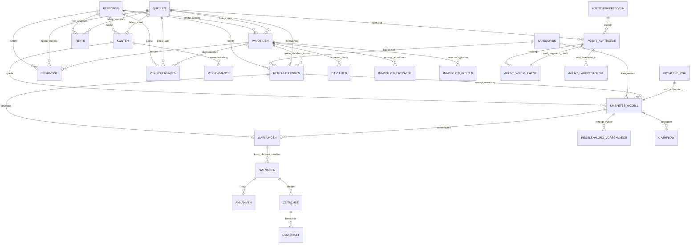

# Finanzmodell - Datenmodell

Stand: 18.05.2026

Diese Datei dokumentiert die technische Struktur der geplanten Excel-Mappe: Tabellen, Primaerschluessel, Fremdschluessel, Beziehungen und Modellwirkungen. Sie wird fortlaufend ergaenzt, sobald neue Tabellen, Felder oder Beziehungen entschieden werden.

## Arbeitsregel

- Vor spaeterer Weiterarbeit soll diese Datei zusammen mit `Finanzmodell_Entscheidungsprotokoll.md` gelesen werden.
- Fuer Agentenimport, Analyse, Recherche und Umsetzung soll zusaetzlich `Finanzmodell_Agentenworkflow.md` gelesen werden.
- Neue Tabellen oder Felder werden hier ergaenzt, sobald sie als Designentscheidung bestaetigt sind.
- Primaerschluessel bleiben stabil und werden nicht ohne dokumentierte Migration geaendert.
- Fremdschluessel sind in Excel als ID-Spalten umzusetzen, auch wenn Excel keine echte Datenbank ist.
- Beziehungen sind logisch zu verstehen; die Umsetzung erfolgt ueber Tabellen, strukturierte Verweise, XLOOKUP/INDEX-MATCH, Power Query oder spaetere Hilfstabellen.
- Nummernpraefixe bezeichnen Arbeitsblaetter bzw. fachliche Module. Mehrere strukturierte Tabellen duerfen denselben Nummernpraefix tragen, wenn sie auf demselben Blatt/Modul liegen, z. B. `05_Darlehen`, `05_Immobilien_Ertraege` und `05_Immobilien_Kosten` auf dem Blatt `05_Immobilien_Details`.
- Jede Spalte jeder strukturierten Excel-Tabelle bekommt im Workbook eine Spaltendokumentation, bevorzugt als Kommentar/Hinweis auf der Tabellenueberschrift.
- Spaltendokumentation muss mindestens erklaeren: Bedeutung, Zweck im Modell, erlaubte Werte oder Format, wichtige Verknuepfungen/Fremdschluessel, Auswirkung auf Auswertungen/Checks und warum die Spalte wichtig ist.
- Die Excel-Mappe soll eine kompakte Legende enthalten, die Eingabefelder, Formelfelder, Statusfelder, Quellenfelder, Prueffelder und manuelle Override-Felder fuer den Nutzer erklaert.
- Relevante Detailblaetter bekommen oben einen kompakten Kennzahlen-/Statusbereich. Darunter liegen die strukturierten Detailtabellen. Das Dashboard greift bevorzugt auf diese kuratierten Detailkennzahlen zu, nicht direkt auf jede einzelne Roh- oder Detailtabelle.

## V1-Konventionen fuer reproduzierbare Umsetzung

Diese Konventionen sind fuer den ersten Excel-Bau verbindlich, damit Builder, Tests und spaetere Agentenlaeufe wiederholbar arbeiten.

### ID-Konventionen

| ID | Schema | Beispiel |
|---|---|---|
| `Import_ID` | `IMP-YYYYMMDD-NNN` | `IMP-20260518-001` |
| `Rohumsatz_ID` | `RAW-{Import_ID}-{Zeilennummer_Import}` | `RAW-IMP-20260518-001-000001` |
| `Transaktion_ID` | `TXN-{Rohumsatz_ID}` | `TXN-RAW-IMP-20260518-001-000001` |
| `Quelle_ID` | `SRC-YYYYMMDD-NNN` | `SRC-20260518-001` |
| `Lauf_ID` | `RUN-YYYYMMDD-NNN` | `RUN-20260518-001` |
| `Auftrag_ID` | `JOB-YYYYMMDD-NNN` | `JOB-20260518-001` |
| `Vorschlag_ID` | `SUG-YYYYMMDD-NNN` | `SUG-20260518-001` |
| `Transfer_Regel_ID` | `TRF-YYYYMMDD-NNN` | `TRF-20260518-001` | <!-- Fix: Baubarkeit-Nachlieferung -->

`NNN` ist eine dreistellige laufende Nummer je Datum und ID-Typ. Diese Konvention dient der Reproduzierbarkeit; spaeter kann eine Migration auf andere ID-Generatoren dokumentiert werden.

<!-- Fix: SUG-ID Konvention + CHK-SUG-01 -->
`SUG-`-ID-Erzeugungsregel: `12_Regelzahlung_Vorschlaege` ist die Quelle — dort wird die `SUG-`-ID neu vergeben und der Tageszaehler (`NNN`) inkrementiert. `73_Agent_Vorschlaege` ist der Spiegel — er kopiert die ID aus `12_Regelzahlung_Vorschlaege` und erzeugt nie eine eigene `SUG-`-ID. Nie umgekehrt.

### Normierte Statuswerte

Fachliche Zieltabellen nutzen in Excel diese exakte Schreibweise:

- `offen`
- `belegt`
- `geprueft`
- `geschaetzt`
- `inaktiv`

Annahmen nutzen in Excel diese exakte Schreibweise:

- `platzhalter`
- `geschaetzt`
- `belegt`
- `geprueft`

Agentenauftraege nutzen:

- `offen`
- `in_arbeit`
- `erledigt`
- `verworfen`

Agentenvorschlaege nutzen:

- `offen`
- `angenommen`
- `abgelehnt`
- `zurueckgestellt`
- `erledigt`

Umsetzungsstatus nutzt:

- `nicht_beauftragt`
- `auftrag_erstellt`
- `umgesetzt`
- `nicht_umsetzbar`

### Agentische Update-Modi

| Tabelle | Update-Modus V1 |
|---|---|
| `10_Umsaetze_Roh` | `append_only` |
| `10_Importlaeufe` | `append_only` |
| `11_Umsaetze_Modell` | `kontrolliertes_update` |
| `11_Transferregeln` | `nur_durch_angenommenen_vorschlag` | <!-- Fix: Baubarkeit-Nachlieferung -->
| `12_Regelzahlungen` | `nur_durch_angenommenen_vorschlag` |
| `12_Regelzahlung_Vorschlaege` | `append_or_update_by_fingerprint` |
| `40_Szenarien` | `manuell` |
| `42_Annahmen` | `historisiert` |
| `60_Warnungen_Bearbeitung` | `manuell` |
| `71_Agent_Auftraege` | `append_or_status_update` |
| `72_Agent_Pruefregeln` | `manuell` |
| `73_Agent_Vorschlaege` | `append_or_status_update` |
| `74_Agent_Laufprotokoll` | `append_only` |
| `90_Quellen` | `append_or_update_by_hash` |
| `99_Checks` | `manuell_erweiterbar` |

Agenten duerfen keine Tabelle ausserhalb ihres erlaubten Update-Modus veraendern. Wenn ein Update fachlich noetig, aber vom Modus nicht gedeckt ist, muss ein Auftrag oder Vorschlag entstehen.

## Finale Blattstruktur Version 1

| Blatt | Tabellen / Bereiche |
|---|---|
| `00_Dashboard` | Dashboardbereiche, Modellstatus, Top-Warnungen, Agenten-To-dos |
| `01_Personen` | `01_Personen` |
| `02_Kategorien` | `02_Kategorien` |
| `03_Konten` | `03_Konten` |
| `04_Immobilien` | `04_Immobilien` |
| `05_Immobilien_Details` | `05_Darlehen`, `05_Immobilien_Ertraege`, `05_Immobilien_Kosten` |
| `06_Versicherungen` | `06_Versicherungen` |
| `07_Rente` | `07_Rente` |
| `10_Umsaetze_Roh` | `10_Importlaeufe`, `10_Umsaetze_Roh` |
| `11_Umsaetze_Modell` | `11_Umsaetze_Modell`, `11_Transferregeln` |
| `12_Regelzahlungen` | `12_Regelzahlungen`, `12_Regelzahlung_Vorschlaege` |
| `20_Vermoegen` | `20_Vermoegen` |
| `30_Cashflow` | `30_Cashflow` |
| `40_Szenarien` | Szenario-Cockpit, `40_Szenarien` |
| `41_Ereignisse` | `41_Ereignisse`, `41_Erwerbsstatus`, `41_Sozialleistungen` |
| `42_Annahmen` | `42_Annahmen` |
| `43_Zeitachse` | `43_Zeitachse` |
| `44_Liquiditaet` | `44_Liquiditaet` |
| `45_Sensitivitaet` | `45_Sensitivitaet` |
| `50_Performance` | `50_Performance` |
| `60_Warnungen` | Uebersicht, `60_Warnungen_Aktuell`, `60_Warnungen_Bearbeitung`, `60_Warnungen` |
| `70_Agentenworkflow` | Methodik- und Orientierungsbereich |
| `71_Agent_Auftraege` | `71_Agent_Auftraege` |
| `72_Agent_Pruefregeln` | `72_Agent_Pruefregeln` |
| `73_Agent_Vorschlaege` | `73_Agent_Vorschlaege` |
| `74_Agent_Laufprotokoll` | `74_Agent_Laufprotokoll` |
| `90_Quellen` | `90_Quellen` |
| `99_Checks` | Modellstatus-Uebersicht, `99_Checks` |

## Entity-Relationship-Ueberblick



## Tabellen und Schluessel

### `00_Dashboard`

Zweck: Zentrale Entscheidungssicht fuer Modellstatus, heutigen Finanzstand, laufende Tragfaehigkeit, Arbeitsende-/Liquiditaetsfrage, wichtigste Warnungen und Agenten-To-dos.

Primaerschluessel: keiner; Dashboard ist eine formelbasierte Sicht.

Dashboard-Reihenfolge Version 1:

1. `Modellstatus`
2. `Vermoegen_und_Liquiditaet`
3. `Cashflow_heute`
4. `Arbeitsende_und_Reichweite`
5. `Top_Warnungen`
6. `Agenten_To-dos`

Bereich `Modellstatus`:

- Gesamtstatus (`Gruen`, `Gelb`, `Rot`)
- Aussage (`belastbar`, `nutzbar_mit_Einschraenkung`, `nicht_belastbar`)
- Letzte Aktualisierung
- Aktives Szenario
- Anzahl Fehler
- Anzahl offene Warnungen
- Anzahl Platzhalter-Annahmen
- Anzahl ungepruefte kritische Quellen
- kritischster Check
- Verweis auf `99_Checks`

Bereich `Vermoegen_und_Liquiditaet`:

- Nettovermoegen gesamt
- liquide Mittel
- Sicherheitsreserve
- freie Liquiditaet nach Reserve
- Immobilienwert separat
- Schulden/Darlehen separat
- anlegbare Mittel separat
- Anteil liquide/gebunden
- Standdatum
- Quellenstatus der wichtigsten Bestandswerte

Bereich `Cashflow_heute`:

- monatliche Einnahmen
- monatliche Ausgaben
- nachhaltiger monatlicher Cashflow
- Lebenshaltungskosten
- Sparen/Investieren
- neutralisierte interne Transfers
- freier Immobilien-Cashflow
- Plan/Ist-Abweichung aktueller Monat
- Durchschnitt letzter 3, 6 und 12 Monate, falls genug Daten vorhanden
- Anteil `Sonstiges / zu pruefen`

Bereich `Arbeitsende_und_Reichweite`:

- geplantes Arbeitsende P01
- geplantes Arbeitsende P02
- Planungsende/Lebenserwartung
- Liquiditaetsluecke
- Luecke ab Jahr
- Reichweite bis Jahr
- liquide Mittel am Arbeitsende
- tiefster Liquiditaetsstand
- Jahr mit kritischster Liquiditaet
- Status der zugrunde liegenden Annahmen
- Hinweis, ob Immobilien im Standardszenario liquide wirken

Bereich `Top_Warnungen`:

- Top 5 offene Warnungen nach Sortierregel
- Bereich
- Kurzbeschreibung
- Schweregrad
- Status
- Faellig_bis
- Betroffene_Tabelle
- Betroffene_ID
- Verweis auf `60_Warnungen`

Sortierregel fuer Top-Warnungen: zuerst `Fehler`, dann `Warnung`, dann `Hinweis`; innerhalb gleicher Schwere nach `Dashboard_Relevant`, `Faellig_bis` und Datum. Erledigte, bestaetigt in Ordnung gesetzte oder erklaert ignorierte Warnungen erscheinen nicht in den Top-Warnungen, ausser ein spaeterer Refresh erzeugt wieder eine aktuelle offene Warnung mit neuem oder wieder aktivem Fingerprint.

Bereich `Agenten_To-dos`:

- offene Agentenauftraege gesamt
- ueberfaellige Agentenauftraege
- hoch priorisierte offene Vorschlaege
- angenommene Vorschlaege ohne Umsetzungsauftrag
- nicht umsetzbare Vorschlaege
- fehlerhafte Agentenlaeufe
- naechste empfohlene Aktion
- Verweis auf `71_Agent_Auftraege` und `73_Agent_Vorschlaege`

Modellregel: Das Dashboard zeigt nur entscheidungsrelevante Kennzahlen und Statusinformationen. Vollstaendige Listen bleiben auf den Detailblaettern. Die Dashboardwerte sollen aus strukturierten Detailtabellen oder aus den Kennzahlen-/Statusbereichen der Detailblaetter kommen und nicht aus manuell selektierten Zellen.

### `01_Personen`

Zweck: Familienmitglieder und Haushaltsebene abbilden.

Primaerschluessel: `Person_ID`

Wichtige Felder:

- `Person_ID`
- `Name_Rolle`
- `Typ` (`Person`, `Haushalt`)
- `Geburtsdatum`
- `Alter_aktuell`
- `Renteneintritt_alter`
- `Status`
- `Kommentar`

Bekannte Werte:

- `P01` = Nutzer
- `P02` = Ehefrau
- `HH` = Haushalt / Familie

### `41_Ereignisse`

Zweck: Terminierte Zukunftsereignisse wie Lebensversicherung, Werksrente, Darlehensende, Verkauf, Sonderzahlung.

Primaerschluessel: `Ereignis_ID`

Fremdschluessel:

- `Person_ID` -> `01_Personen.Person_ID`
- `Quelle_ID` -> `90_Quellen.Quelle_ID`
- optional `Objekt_ID` -> `04_Immobilien.Objekt_ID`

Wichtige Felder:

- `Ereignis_ID`
- `Person_ID`
- `Ereignistyp`
- `Startdatum`
- `Enddatum`
- `Betrag`
- `Betragstyp` (`einmalig`, `monatlich`, `jaehrlich`)
- `Steigerung_pa`
- `Quelle_ID`
- `Status`
- `Szenario_relevant`

### `41_Erwerbsstatus`

Zweck: Erwerbseinkommen je Person, Szenario und Zeitraum steuern, damit volles Einkommen, reduziertes Einkommen, kein Einkommen und Uebergangsphasen beherrschbar abgebildet werden.

Primaerschluessel: `Erwerbsstatus_ID`

Fremdschluessel:

- `Person_ID` -> `01_Personen.Person_ID`
- optional `Szenario_ID` -> `40_Szenarien.Szenario_ID`
- optional `Quelle_ID` -> `90_Quellen.Quelle_ID`

Wichtige Felder:

- `Erwerbsstatus_ID`
- `Person_ID`
- `Szenario_ID`
- `Gueltig_von`
- `Gueltig_bis`
- `Status_Typ` (`voll_beschaeftigt`, `teilzeit`, `arbeitslos`, `krankengeld`, `elternzeit`, `ruhestand`, `sonstiges`)
- `Einkommensfaktor`
- `Quelle_ID`
- `Status` (`platzhalter`, `geschaetzt`, `belegt`, `geprueft`)
- `Kommentar`

Modellregel: Geplantes Erwerbseinkommen wird in der Zeitachse nicht blind fortgeschrieben, sondern mit dem passenden `Einkommensfaktor` aus `41_Erwerbsstatus` multipliziert. Ueberlappende oder fehlende Erwerbsstatus-Zeitraeume sollen in `99_Checks` sichtbar werden.

### `41_Sozialleistungen`

Zweck: Bekannte oder geplante Sozialleistungen als Ersatz- oder Ergaenzungsleistungen modellieren, ohne ein vollstaendiges Sozialrechtsmodell zu bauen.

Primaerschluessel: `Sozialleistung_ID`

Fremdschluessel:

- `Person_ID` -> `01_Personen.Person_ID`
- optional `Szenario_ID` -> `40_Szenarien.Szenario_ID`
- optional `Regel_ID` -> `12_Regelzahlungen.Regel_ID`
- optional `Ereignis_ID` -> `41_Ereignisse.Ereignis_ID`
- optional `Quelle_ID` -> `90_Quellen.Quelle_ID`

Wichtige Felder:

- `Sozialleistung_ID`
- `Person_ID`
- `Szenario_ID`
- `Leistungsart`
- `Name`
- `Betrag`
- `Betragstyp` (`einmalig`, `monatlich`, `jaehrlich`)
- `Brutto_Netto` (`brutto`, `netto`, `unklar`)
- `Startdatum`
- `Enddatum`
- `Ersetzt_Einkommen`
- `Ergaenzt_Einkommen`
- `Anrechnungslogik` (`keine`, `ersetzt_anteilig`, `zusaetzlich`, `manuell`)
- `Einkommensanrechnung_Prozent`
- `Regel_ID`
- `Ereignis_ID`
- `Quelle_ID`
- `Status` (`platzhalter`, `beantragt`, `bewilligt`, `abgelehnt`, `geschaetzt`, `geprueft`)
- `Szenario_Relevanz`
- `Unsicherheit`
- `Kommentar`

Modellregel: Sozialleistungen koennen Einkommen ersetzen, ergaenzen, anteilig ersetzen oder manuell als Sonderfall gefuehrt werden. Sie begruenden keinen automatischen Anspruch; Anspruch, Hoehe und Zeitraum muessen ueber Status und Quelle sichtbar bleiben. Zeitliche Ueberschneidungen mit Erwerbseinkommen sind erlaubt, sollen aber eine Pruefung/Warnung erzeugen, wenn die Anrechnungslogik unklar ist.

### `10_Umsaetze_Roh`

Zweck: Originalnaher Import der Girokonto-CSV mit technischer Import- und Auditspur.

Primaerschluessel: `Rohumsatz_ID`

Fremdschluessel:

- `Import_ID` -> `10_Importlaeufe.Import_ID`
- `Quellkonto_ID` -> `03_Konten.Konto_ID`

Technische Importfelder:

- `Rohumsatz_ID`
- `Import_ID`
- `Quellkonto_ID`
- `Importdatei`
- `Importdatum`
- `Zeilennummer_Import`
- `Zeilenhash`
- `Duplikat_Status` (`neu`, `bereits_importiert`, `moegliches_duplikat`, `ignoriert`)
- `Parse_Status` (`ok`, `betrag_unplausibel`, `datum_unplausibel`, `feld_fehlt`)
- `Parse_Hinweis`

Bank-Originalfelder:

- `Buchungsdatum`
- `Wertstellung`
- `Status_Bank`
- `Zahlungspflichtiger`
- `Zahlungsempfaenger`
- `Verwendungszweck`
- `Umsatztyp`
- `IBAN`
- `Betrag`
- `Glaeubiger_ID`
- `Mandatsreferenz`
- `Kundenreferenz`

Modellregel: Rohdaten werden moeglichst nicht manuell veraendert. Fachlich originale Bankfelder bleiben erhalten; technische Importfelder dienen nur Nachvollziehbarkeit, Deduplizierung und Importqualitaet.

Importregel: Deutsche Datums- und Betragsformate werden explizit geparst und geprueft. Tausenderpunkte und Dezimalkommas duerfen nicht verwechselt werden, z. B. `-4.501` = `-4501,00` und `-8,67` = `-8,67`.

Hash- und Deduplizierungsregel: `Zeilenhash` wird aus normalisierten Kernfeldern gebildet: `Quellkonto_ID`, `Buchungsdatum`, `Wertstellung`, `Zahlungspflichtiger`, `Zahlungsempfaenger`, `Verwendungszweck`, `Umsatztyp`, `IBAN`, Betrag in Cent, `Glaeubiger_ID`, `Mandatsreferenz` und `Kundenreferenz`. Ein gleicher Hash in vorhandenen Rohdaten gilt als `bereits_importiert`. Gleiche Kernfelder mit unvollstaendiger oder abweichender Referenz gelten als `moegliches_duplikat`. Neue Kombinationen gelten als `neu`.

### `10_Importlaeufe`

Zweck: Protokoll aller CSV-Importe, damit wiederholte oder ueberlappende Importe nachvollziehbar und deduplizierbar bleiben.

Primaerschluessel: `Import_ID`

Fremdschluessel:

- `Quellkonto_ID` -> `03_Konten.Konto_ID`
- `Quelle_ID` -> `90_Quellen.Quelle_ID`

Wichtige Felder:

- `Import_ID`
- `Importdatei`
- `Quellkonto_ID`
- `Quelle_ID`
- `Zeitraum_von`
- `Zeitraum_bis`
- `Kontostand_Export`
- `Kontostand_Datum`
- `Importdatum`
- `Zeilen_gesamt`
- `Zeilen_importiert`
- `Duplikate`
- `Parse_Fehler`
- `Status` (`importiert`, `teilweise_importiert`, `fehlerhaft`, `verworfen`)
- `Kommentar`

Modellregel: `10_Importlaeufe` kann als eigene Tabelle auf dem Blatt `10_Umsaetze_Roh` gefuehrt werden. Es ist kein eigenes Arbeitsblatt noetig, solange die Tabelle klar benannt und vom Rohumsatzbereich getrennt ist.

Quellenregel: Jede importierte Datei wird als Beleg-Zeile in `90_Quellen` erfasst. `10_Importlaeufe.Quelle_ID` verweist auf diese Quellenzeile. Einzelne Rohumsaetze verweisen ueber `Import_ID` indirekt auf die Quelle.

### `02_Kategorien`

Zweck: Zentrale, dynamisch erweiterbare Kategorien und spaetere Unterkategorien.

Primaerschluessel: `Kategorie_ID`

Wichtige Felder:

- `Kategorie_ID`
- `Grobkategorie`
- `Unterkategorie`
- `Aktiv`
- `Inflationsgruppe`
- `Cashflow_Typ`
- `Beschreibung`

Start-Grobkategorien:

- Einkommen
- Wohnen & Immobilien
- Lebenshaltung
- Mobilitaet
- Versicherungen & Vorsorge
- Gesundheit
- Familie & Haushalt
- Freizeit & Reisen
- Steuern & Abgaben
- Sparen & Investieren
- Kredite & Finanzierung
- Interne Transfers
- Sonstiges / zu pruefen

### `11_Umsaetze_Modell`

Zweck: Aufbereitete, kategorisierte und modellfaehige Umsaetze.

Primaerschluessel: `Transaktion_ID`

Fremdschluessel:

- `Rohumsatz_ID` -> `10_Umsaetze_Roh.Rohumsatz_ID`
- `Kategorie_ID` -> `02_Kategorien.Kategorie_ID`
- `Person_ID` -> `01_Personen.Person_ID`
- `Konto_ID` -> `03_Konten.Konto_ID`
- optional `Zielkonto_ID` -> `03_Konten.Konto_ID`
- optional `Regel_ID` -> `12_Regelzahlungen.Regel_ID`
- optional `Transfer_Regel_ID` -> `11_Transferregeln.Transfer_Regel_ID`
- optional `Gegenbuchung_Transaktion_ID` -> `11_Umsaetze_Modell.Transaktion_ID`

Wichtige Felder:

- `Transaktion_ID`
- `Rohumsatz_ID`
- `Konto_ID`
- `Zielkonto_ID`
- `Kategorie_ID`
- `Person_ID`
- `Regel_ID`
- `Regel_Match_Status` (`kein_match`, `match_kandidat`, `bestaetigter_match`, `falsch_zugeordnet`, `unklar`)
- `Regel_Match_Hinweis`
- `Erwartetes_Zahldatum`
- `Betragsabweichung`
- `Tage_Abweichung`
- `Betrag`
- `Buchungsmonat`
- `Cashflow_Wirkung` (`Einnahme`, `Ausgabe`, `neutral`, `Investition`, `Tilgung`, `Transfer`)
- `Szenario_Wirkung` (`einmalig`, `dauerhaft`, `keine`, `zu_pruefen`)
- `Ist_Transfer`
- `Transfer_Status` (`kein_transfer`, `transfer_kandidat`, `bestaetigter_transfer`, `kein_transfer_bestaetigt`, `unklar`)
- `Transfer_Typ` (`Eigenumbuchung`, `Haushaltsumbuchung`, `Depotanlage`, `Sparen`, `Darlehen_Tilgung`, `Kreditkartenabbuchung`, `Rueckerstattung`, `Sonstiges`)
- `Gegenbuchung_Transaktion_ID`
- `Transfer_Regel_ID`
- `Lebenshaltung_Relevant`
- `Transfer_Pruefhinweis`
- `Status`
- `Kommentar`

Modellregel: Interne Umbuchungen werden als neutral bzw. Vermoegensumschichtung behandelt und duerfen Lebenshaltungskosten nicht verfaelschen. Transfer-Kandidaten werden jedoch nicht automatisch neutralisiert. Erst `Transfer_Status = bestaetigter_transfer` oder eine bewusst gesetzte `Cashflow_Wirkung` darf Auswertungen entsprechend veraendern. Unklare Transfers bleiben pruefpflichtig und sollen in `99_Checks` bzw. `60_Warnungen` sichtbar werden.

### `11_Transferregeln`

Zweck: Wiederverwendbare Regeln, die moegliche interne Transfers oder Vermoegensumschichtungen vorschlagen.

Primaerschluessel: `Transfer_Regel_ID`

Fremdschluessel:

- optional `Konto_ID` -> `03_Konten.Konto_ID`
- optional `Zielkonto_ID` -> `03_Konten.Konto_ID`

Wichtige Felder:

- `Transfer_Regel_ID`
- `Name`
- `Aktiv`
- `Prioritaet`
- `Konto_ID`
- `Zielkonto_ID`
- `Gegenpartei_Muster`
- `IBAN_Muster`
- `Verwendungszweck_Muster`
- `Betrag_Min`
- `Betrag_Max`
- `Datums_Toleranz_Tage`
- `Transfer_Typ`
- `Vorgeschlagene_Cashflow_Wirkung`
- `Lebenshaltung_Relevant_Vorschlag`
- `Status` (`vorgeschlagen`, `bestaetigt`, `pausiert`, `verworfen`)
- `auto_person_id` (optional; erlaubte Werte: `HH` oder leer — wenn gesetzt, wird `Person_ID` bei matchenden Transaktionen in `11_Umsaetze_Modell` automatisch auf diesen Wert gesetzt) <!-- Fix: Baubarkeit-Nachlieferung -->
- `Kommentar`

Modellregel: Transferregeln erzeugen nur Vorschlaege. Sie duerfen Buchungen nicht stillschweigend endgueltig klassifizieren, solange der Nutzer die Regel oder den konkreten Treffer nicht bestaetigt hat.

### `12_Regelzahlungen`

Zweck: Stammdaten fuer wiederkehrende Einnahmen und Ausgaben.

Primaerschluessel: `Regel_ID`

Fremdschluessel:

- `Kategorie_ID` -> `02_Kategorien.Kategorie_ID`
- `Person_ID` -> `01_Personen.Person_ID`
- optional `Konto_ID` -> `03_Konten.Konto_ID`
- optional `Quelle_ID` -> `90_Quellen.Quelle_ID`
- optional `Objekt_ID` -> `04_Immobilien.Objekt_ID`

Wichtige Felder:

- `Regel_ID`
- `Name`
- `Typ` (`Einnahme`, `Ausgabe`, `Transfer`)
- `Kategorie_ID`
- `Person_ID`
- `Konto_ID`
- `Quelle_ID`
- `Frequenz` (`taeglich`, `woechentlich`, `monatlich`, `quartalsweise`, `halbjaehrlich`, `jaehrlich`, `unregelmaessig_geplant`)
- `Erwarteter_Betrag`
- `Toleranz_Betrag`
- `Toleranz_Prozent`
- `Erwarteter_Tag`
- `Gegenpartei_Muster`
- `IBAN_Muster`
- `Verwendungszweck_Muster`
- `Betrag_Min`
- `Betrag_Max`
- `Betrag_Variabel`
- `Faelligkeitstag`
- `Faelligkeitstoleranz_Tage`
- `Matching_Status` (`nicht_geprueft`, `kandidaten_gefunden`, `teilweise_gematcht`, `vollstaendig_gematcht`, `abweichung`, `pausiert`)
- `Auto_Matching_Erlaubt`
- `Startdatum`
- `Enddatum`
- `Status` (`vorgeschlagen`, `bestaetigt`, `pausiert`, `beendet`, `zu_pruefen`)
- `Szenario_Wirkung`
- `Kommentar`

Modellregel: Regelzahlungen werden gegen Ist-Umsaetze abgeglichen. Matching-Muster erzeugen Kandidaten; endgueltige Zuordnungen entstehen durch Bestaetigung oder durch bewusst erlaubtes Auto-Matching fuer bestaetigte Regeln. Fehlende, doppelte, zu fruehe, zu spaete oder betragsabweichende Zahlungen erzeugen Eintraege in `60_Warnungen`.

### `12_Regelzahlung_Vorschlaege`

Zweck: Automatisch erkannte Vorschlaege fuer neue wiederkehrende Zahlungen aus historischen Umsaetzen.

Primaerschluessel: `Vorschlag_ID`

Fremdschluessel:

- optional `Kategorie_ID_Vorschlag` -> `02_Kategorien.Kategorie_ID`
- optional `Person_ID_Vorschlag` -> `01_Personen.Person_ID`
- optional `Konto_ID` -> `03_Konten.Konto_ID`

Wichtige Felder:

- `Vorschlag_ID`
- `Erkannt_am`
- `Vorgeschlagener_Name`
- `Vorgeschlagene_Frequenz` (`woechentlich`, `monatlich`, `quartalsweise`, `halbjaehrlich`, `jaehrlich`, `unregelmaessig_geplant`)
- `Treffer_Anzahl`
- `Erstes_Datum`
- `Letztes_Datum`
- `Median_Betrag`
- `Betrag_Min`
- `Betrag_Max`
- `Betrag_Variabilitaet`
- `Typ` (`Einnahme`, `Ausgabe`, `Transfer`, `zu_pruefen`)
- `Kategorie_ID_Vorschlag`
- `Person_ID_Vorschlag`
- `Konto_ID`
- `Gegenpartei_Muster`
- `IBAN_Muster`
- `Verwendungszweck_Muster`
- `Konfidenz`
- `Status` (`neu`, `uebernommen`, `ignoriert`, `zusammengefuehrt`, `zu_pruefen`)
- `Erkennungs_Hinweis`
- `Kommentar`

Erkennungsregeln:

- Monatlich: mindestens 3 Treffer in aufeinanderfolgenden oder fast aufeinanderfolgenden Monaten.
- Quartalsweise: mindestens 3 Treffer mit ungefaehr 3 Monaten Abstand.
- Halbjaehrlich: mindestens 3 Treffer mit ungefaehr 6 Monaten Abstand oder 2 Treffer mit plausibler Gegenpartei und stabilem Betrag.
- Jaehrlich: mindestens 2 Treffer in aufeinanderfolgenden Jahren.
- Woechentlich: mehrere Treffer mit ungefaehr 7 Tagen Abstand.
- Unregelmaessig geplant: wiederkehrende Gegenpartei, aber schwankendes Datum oder schwankender Betrag.

Modellregel: Vorschlaege sind keine echten Regelzahlungen. Erst wenn der Nutzer einen Vorschlag uebernimmt, entsteht ein Eintrag in `12_Regelzahlungen`. Moegliche interne Umbuchungen werden als `Typ = Transfer` oder `Typ = zu_pruefen` vorgeschlagen und duerfen nicht automatisch als Ausgabe oder Einnahme wirken.

Abgrenzung zu `73_Agent_Vorschlaege`: `12_Regelzahlung_Vorschlaege` enthaelt die fachliche Mustererkennung aus Umsaetzen. Wenn daraus eine Nutzerentscheidung noetig ist, erzeugt der Analyse-Agent zusaetzlich eine Zeile in `73_Agent_Vorschlaege` mit `Betroffene_Tabelle = 12_Regelzahlung_Vorschlaege` und `Betroffene_ID = Vorschlag_ID`. Die Regelzahlung wird erst nach Nutzerentscheidung und Umsetzung in `12_Regelzahlungen` angelegt.

<!-- Fix: SUG-ID Konvention + CHK-SUG-01 -->
Lifecycle-Konsistenzregel: Statusaenderungen in `12_Regelzahlung_Vorschlaege` muessen synchron auf den Gegeneintrag in `73_Agent_Vorschlaege` uebertragen werden — und umgekehrt. Kein Eintrag darf in einer Tabelle aktiv sein, waehrend er in der anderen `verworfen` ist. `CHK-SUG-01` ueberwacht diese Konsistenz.

<!-- Fix: Baubarkeit-Nachlieferung -->
Kanonisches Status-Aequivalenz-Mapping fuer `CHK-SUG-01`: `ignoriert` (in `12_Regelzahlung_Vorschlaege`) entspricht `verworfen` (in `73_Agent_Vorschlaege`). Beide Zustaende gelten als endgueltig abgebrochen; ein Eintrag mit `Status = ignoriert` in `12` muss einen Gegeneintrag mit `Status = verworfen` in `73` haben — und umgekehrt.

### `20_Vermoegen`

Zweck: Aggregierte Vermoegensuebersicht nach Person, Haushalt und Gesamtfamilie.

Primaerschluessel: optional `Vermoegen_Position_ID`, falls Detailtabelle noetig.

Quellen:

- `03_Konten`
- `04_Immobilien`
- `06_Versicherungen`
- `07_Rente` nur fuer Ansprueche/Zukunft, nicht zwingend Kapitalwert
- Schulden/Darlehen aus `05_Darlehen` oder optional `03_Konten`

Kennzahlen-/Statusbereich:

- Nettovermoegen
- Liquide_Mittel
- Freie_Liquiditaet_nach_Reserve
- Gebundene_Mittel
- Immobilienwert
- Schulden_Darlehen
- Anlegbare_Mittel
- Anteil_Liquide
- Anteil_Gebunden
- Quellenstatus_Bestandswerte
- Standdatum_juengster_Wert
- Standdatum_aeltester_Wert

Modellregel: Nettovermoegen und Liquiditaet werden getrennt ausgewiesen.

### `03_Konten`

Zweck: Stammdaten fuer mehrere Konten, Bankverbindungen, Depots und liquide Anlagen.

Primaerschluessel: `Konto_ID`

Fremdschluessel:

- `Person_ID` -> `01_Personen.Person_ID`
- optional `Quelle_ID` -> `90_Quellen.Quelle_ID`

Wichtige Felder:

- `Konto_ID`
- `Name`
- `Anbieter`
- `Kontoart` (`Giro`, `Tagesgeld`, `Festgeld`, `Depot`, `Verrechnungskonto`, `Darlehen`, `Sonstiges`)
- `Person_ID`
- `Eigentumsanteil`
- `Maskierte_IBAN_Depotnummer`
- `Aktueller_Stand`
- `Standdatum`
- `Quelle_ID`
- `Liquide_relevant`
- `Performance_relevant`
- `Transferfaehig`
- `Status`
- `Kommentar`

### `04_Immobilien`

Zweck: Immobilienbestand als Objekt-Stammdaten und kompakte Objektuebersicht. Darlehen, Ertraege, Kosten und Rueckstellungen werden aus Usability-Gruenden auf dem separaten Blatt `05_Immobilien_Details` gefuehrt.

Primaerschluessel: `Objekt_ID`

Fremdschluessel:

- `Person_ID` oder Eigentuemerlogik -> `01_Personen.Person_ID`
- optional `Quelle_ID` -> `90_Quellen.Quelle_ID`

Wichtige Felder:

- `Objekt_ID`
- `Name`
- `Nutzung` (`selbstgenutzt`, `vermietet`, `gemischt`)
- `Eigentuemer`
- `Eigentumsanteil`
- `Objektwert`
- `Wertdatum`
- `Quelle_ID`
- `Liquiditaet_im_Standardszenario` (`nein`, `teilweise`, `ja`)
- `Status`
- `Kommentar`

Modellregel: Immobilienwert zaehlt zum Nettovermoegen, aber im Standardszenario nicht automatisch zur Liquiditaet. Nur der aus Ertraegen, Kosten, Darlehen und Rueckstellungen aggregierte freie Immobilien-Cashflow fliesst in Liquiditaetsluecke und Reichweite ein.

Usability-Regel: Das Blatt `04_Immobilien` bleibt auf Objekt-Stammdaten und eine kompakte Objektuebersicht begrenzt. Detailtabellen fuer Finanzierung, Ertraege, Kosten und Rueckstellungen liegen auf `05_Immobilien_Details`, damit die Immobilienpflege nicht in einem ueberladenen Einzelblatt stattfindet.

### `05_Darlehen`

Zweck: Beliebig viele Darlehen oder Finanzierungen je Immobilie abbilden.

Blatt: `05_Immobilien_Details`

Primaerschluessel: `Darlehen_ID`

Fremdschluessel:

- `Objekt_ID` -> `04_Immobilien.Objekt_ID`
- optional `Person_ID` oder `Schuldner_ID` -> `01_Personen.Person_ID`
- optional `Regel_ID_Rate` -> `12_Regelzahlungen.Regel_ID`
- optional `Quelle_ID` -> `90_Quellen.Quelle_ID`

Wichtige Felder:

- `Darlehen_ID`
- `Objekt_ID`
- `Person_ID`
- `Anbieter`
- `Darlehensart`
- `Ursprungsbetrag`
- `Restschuld`
- `Standdatum`
- `Zinssatz`
- `Zinsbindung_bis`
- `Rate_pM`
- `Tilgung_pM`
- `Zins_pM`
- `Sondertilgung_erlaubt`
- `Enddatum_geplant`
- `Regel_ID_Rate`
- `Quelle_ID`
- `Status`
- `Kommentar`

Modellregel: Darlehensraten wirken als Immobilien-Cashflow-Minderung. Tilgung reduziert Schulden und beeinflusst Nettovermoegen anders als Zinsen oder laufende Objektkosten. Mehrere Darlehen pro Objekt werden aggregiert.

### `05_Immobilien_Ertraege`

Zweck: Mehrere Einnahmequellen je Immobilie abbilden, z. B. Miete, Stellplatzmiete oder Verkauf von Strom aus einer PV-Anlage.

Blatt: `05_Immobilien_Details`

Primaerschluessel: `Objekt_Ertrag_ID`

Fremdschluessel:

- `Objekt_ID` -> `04_Immobilien.Objekt_ID`
- optional `Regel_ID` -> `12_Regelzahlungen.Regel_ID`
- optional `Quelle_ID` -> `90_Quellen.Quelle_ID`

Wichtige Felder:

- `Objekt_Ertrag_ID`
- `Objekt_ID`
- `Ertragsart` (`Miete`, `Stellplatz`, `PV_Stromverkauf`, `Nebenkosten_Erstattung`, `Sonstiges`)
- `Name`
- `Betrag_pM`
- `Frequenz`
- `Startdatum`
- `Enddatum`
- `Regel_ID`
- `Steigerung_pa`
- `Quelle_ID`
- `Status`
- `Kommentar`

Modellregel: Immobilien-Ertraege erhoehen den Immobilien-Cashflow, sind aber je nach Ertragsart getrennt auswertbar. Dadurch wird Miete nicht mit PV-Stromverkauf oder sonstigen Objekt-Einnahmen vermischt.

### `05_Immobilien_Kosten`

Zweck: Laufende Objektkosten, Versicherungen, Rueckstellungen und sonstige immobilienbezogene Abfluesse je Objekt abbilden.

Blatt: `05_Immobilien_Details`

Primaerschluessel: `Objekt_Kosten_ID`

Fremdschluessel:

- `Objekt_ID` -> `04_Immobilien.Objekt_ID`
- optional `Regel_ID` -> `12_Regelzahlungen.Regel_ID`
- optional `Quelle_ID` -> `90_Quellen.Quelle_ID`

Wichtige Felder:

- `Objekt_Kosten_ID`
- `Objekt_ID`
- `Kostenart` (`Hausgeld`, `Instandhaltung`, `Rueckstellung`, `Versicherung`, `Grundsteuer`, `Verwaltung`, `Sonstiges`)
- `Name`
- `Betrag_pM`
- `Frequenz`
- `Rueckstellungsmethode` (`Monatsbetrag`, `Prozent`, `Formel`, `nicht_anwendbar`)
- `Startdatum`
- `Enddatum`
- `Regel_ID`
- `Inflationsgruppe`
- `Quelle_ID`
- `Status`
- `Kommentar`

Modellregel: Objektkosten und Rueckstellungen mindern den freien Immobilien-Cashflow. Objektbezogene Versicherungen koennen weiterhin in `06_Versicherungen` gefuehrt werden, sollen aber ueber `Objekt_ID` bzw. eine passende Kostenzeile in den Immobilien-Cashflow eingehen.

### `06_Versicherungen`

Zweck: Vertraege mit Schutz-, Beitrags- oder Vertragscharakter, inklusive Versicherungen, Vorsorgevertraegen, laufenden Beitraegen und moeglichen Ablaufleistungen.

Primaerschluessel: `Versicherung_ID`

Fremdschluessel:

- `Person_ID` -> `01_Personen.Person_ID`
- optional `Objekt_ID` -> `04_Immobilien.Objekt_ID`
- optional `Quelle_ID` -> `90_Quellen.Quelle_ID`
- optional `Beitrag_Regel_ID` -> `12_Regelzahlungen.Regel_ID`
- optional `Ereignis_ID_Leistung` -> `41_Ereignisse.Ereignis_ID`

Wichtige Felder:

- `Versicherung_ID`
- `Person_ID`
- `Versicherte_Person_ID`
- `Zahlungspflichtige_Person_ID`
- `Objekt_ID`
- `Anbieter`
- `Vertragsart`
- `Versicherungsart`
- `Vertragsnummer_maskiert`
- `Vorsorge_Typ` (`laufender_schutz`, `einmalige_kapitalleistung`, `regelmaessige_alterszahlung`, `gemischt`, `sozialversicherung_anspruch`)
- `Primaere_Modellzuordnung` (`Versicherung`, `Rente`, `Ereignis`, `Kosten_Abgabe`)
- `Beitrag`
- `Frequenz`
- `Beitrag_Regel_ID`
- `Beitrag_Brutto_Netto` (`brutto`, `netto`, `unklar`, `nicht_anwendbar`)
- `Beitrag_Dynamik_pa`
- `Cashflow_Zuordnung` (`Person`, `Haushalt`, `Immobilie`)
- `Leistungsart` (`Kapital`, `Rente`, `Risikoschutz`, `Sachversicherung`, `keine_direkte_Leistung`)
- `Leistungsbeginn`
- `Leistungsbetrag`
- `Leistungsbetrag_Brutto_Netto` (`brutto`, `netto`, `unklar`, `nicht_anwendbar`)
- `Ablaufdatum`
- `Erwartete_Auszahlung`
- `Ereignis_ID_Leistung`
- `Quelle_ID`
- `Status`
- `Kommentar`

Modellregel: Objektbezogene Versicherungen koennen einer `Objekt_ID` zugeordnet werden. Dann mindert der Beitrag den Immobilien-Nettoertrag bzw. den freien Immobilien-Cashflow statt nur als allgemeine Vorsorgeausgabe zu laufen.

Klassifikationsregel: Die Modellzuordnung richtet sich nach Funktion, nicht nach Produktnamen oder Rechtsform. Vertraege mit laufendem Schutz, Beitragslogik oder einmaliger Kapital-/Ablaufleistung liegen primaer in `06_Versicherungen`. Wenn aus einem Versicherungs- oder Vorsorgevertrag eine regelmaessige Alterszahlung entsteht, kann der Vertrag hier gefuehrt werden und der eigentliche Rentenanspruch zusaetzlich in `07_Rente` verknuepft werden.

### `07_Rente`

Zweck: Rentenansprueche und regelmaessige Alters-/Ruhestandszahlungen, unabhaengig davon, ob sie rechtlich aus Sozialversicherung, Betriebsrente oder privatem Vorsorge-/Versicherungsvertrag entstehen.

Primaerschluessel: `Rente_ID`

Fremdschluessel:

- `Person_ID` -> `01_Personen.Person_ID`
- optional `Quelle_ID` -> `90_Quellen.Quelle_ID`
- optional `Regel_ID` -> `12_Regelzahlungen.Regel_ID`
- optional `Versicherung_ID` -> `06_Versicherungen.Versicherung_ID`

Wichtige Felder:

- `Rente_ID`
- `Person_ID`
- `Versicherung_ID`
- `Rentenart` (`gesetzliche_Rente`, `Betriebsrente`, `Riester`, `Ruerup_Basisrente`, `private_Rentenversicherung`, `Werksrente`, `sonstige_Rente`)
- `Leistungslogik` (`regelmaessige_alterszahlung`, `sozialversicherung_anspruch`, `gemischt`, `zu_pruefen`)
- `Standdatum`
- `Rentenbeginn`
- `Startdatum`
- `Startalter`
- `Monatsbetrag_heute`
- `Monatsbetrag_bei_Beginn`
- `Brutto_Netto` (`brutto`, `netto`, `unklar`)
- `Steigerung_pa`
- `Abschlag_Zuschlag`
- `Enddatum`
- `Regel_ID_Zahlung`
- `Quelle_ID`
- `Szenario_Relevanz`
- `Status`
- `Unsicherheit`
- `Kommentar`

Modellregel: Wenn die spaetere Leistung als monatliche oder regelmaessige Zahlung ab einem Alter oder Datum in der Ruhestandsplanung wirkt, gehoert der Anspruch nach `07_Rente`. Beispiele: gesetzliche Rente, Betriebsrente, Werksrente, Riester, Ruerup/Basisrente und private Rentenzahlungen. Unsichere oder ungepruefte Ansprueche duerfen nicht stillschweigend als sicherer Zukunfts-Cashflow behandelt werden; Status, Quelle, Unsicherheit und Szenario_Relevanz steuern die Wirkung.

### `30_Cashflow`

Zweck: Monatsauswertung aus Umsaetzen, Regelzahlungen und Planwerten.

Primaerschluessel: Kombination aus `Monat`, `Kategorie_ID`, optional `Person_ID`.

Quellen:

- `11_Umsaetze_Modell`
- `12_Regelzahlungen`
- `04_Immobilien`

Wichtige Auswertungen:

- Einnahmen
- Ausgaben
- Lebenshaltung
- Sparen/Investieren
- Interne Transfers
- freier Immobilien-Cashflow
- monatlicher Ueberschuss
- Plan/Ist-Abweichung

Kennzahlen-/Statusbereich:

- Aktueller_Monat
- Einnahmen_aktueller_Monat
- Ausgaben_aktueller_Monat
- Monatlicher_Ueberschuss
- Nachhaltiger_monatlicher_Cashflow
- Durchschnitt_3M
- Durchschnitt_6M
- Durchschnitt_12M
- Lebenshaltung_aktueller_Monat
- Sparen_Investieren_aktueller_Monat
- Interne_Transfers_neutralisiert
- Freier_Immobilien_Cashflow
- Plan_Ist_Abweichung_aktueller_Monat
- Sonstiges_Anteil
- Datenstatus

Definition: `Nachhaltiger_monatlicher_Cashflow` ist ein geglaetteter Monatswert ohne bestaetigte interne Transfers, erkennbare einmalige Ausreisser und explizit nicht fortzuschreibende Sonderfaelle. In Version 1 wird er pragmatisch aus den letzten 3, 6 oder 12 vollstaendigen Monaten abgeleitet; die verwendete Basis muss im Kennzahlenbereich sichtbar sein.

<!-- formulas.mjs Spezifikation -->
#### Dashboard-KPI-Definitionen fuer `30_Cashflow`

**`Cashflow_Monat_ist`**

Summe aller tatsaechlichen Buchungen im laufenden Kalendermonat aus `10_Umsaetze_Roh` (Einnahmen positiv, Ausgaben negativ).

```text
Cashflow_Monat_ist =
  SUMME(10_Umsaetze_Roh.Betrag)
  WHERE Buchungsdatum >= Monatsanfang AND Buchungsdatum <= heute
```

**`Cashflow_Monat_erwartet`**

Offene Regelzahlungen aus `12_Regelzahlungen` (noch nicht gebucht in diesem Monat) plus variabler Kategorien-Schaetzwert:

```text
Schaetzwert je Kategorie =
  Ø letzte 3 Monate × 0,75 + gleicher Monat Vorjahr × 0,25
  − bereits gebuchte variable Ausgaben dieser Kategorie im laufenden Monat
```

**`Cashflow_Monat_gesamt`**

Prognose des Monatsabschlusses:

```text
Cashflow_Monat_gesamt = Cashflow_Monat_ist + Cashflow_Monat_erwartet
```

### `40_Szenarien`

Zweck: Szenariosteuerung plus kompaktes Szenario-Cockpit fuer den schnellen Ergebnisvergleich.

Primaerschluessel: `Szenario_ID`

Wichtige Felder:

- `Szenario_ID`
- `Name`
- `Szenario_Typ` (`Standard`, `Konservativ`, `Optimistisch`, `Stress`, `Sonderfall`)
- `Basis_Szenario_ID`
- `Aktiv`
- `Aktiv_fuer_Dashboard`
- `Planungsbeginn`
- `Planungsende`
- `Arbeitsende_P01`
- `Arbeitsende_P02`
- `Beschreibung`
- `Status`

Version 1: ein aktives Standardszenario, weitere Szenarien vorbereitet, aber nicht voll parallel ausgebaut.

Cockpit-Bereich auf dem Blatt:

- aktives Szenario
- Planungsbeginn und Planungsende
- Nettovermoegen heute und zum Planungsende
- liquide Mittel und Sicherheitsreserve
- nachhaltiger monatlicher Cashflow
- Liquiditaetsluecke
- Reichweite bis Jahr
- kritischster Modellstatus
- offene kritische Annahmen
- letzte Aktualisierung

Kennzahlen-/Statusbereich: Der Szenario-Cockpit-Bereich ist der Kennzahlen-/Statusbereich des Blatts `40_Szenarien`. Er dient zugleich als Detailbasis fuer die Dashboardwerte zur Arbeitsende-/Liquiditaetsfrage, waehrend `43_Zeitachse` und `44_Liquiditaet` die Rechenbasis enthalten.

Modellregel: Szenarien bleiben in Version 1 bewusst beherrschbar. Das Dashboard nutzt genau ein aktives Szenario. Weitere Szenarien dienen als vorbereitete Struktur oder Kopiervorlage. Das Szenario-Cockpit zeigt die entscheidungsrelevanten Ergebnisse direkt auf `40_Szenarien`, waehrend `44_Liquiditaet` die detaillierte Rechenbasis bleibt.

### `42_Annahmen`

Zweck: Zentrale Stellhebel fuer Szenarien.

Primaerschluessel: `Annahme_ID`

Fremdschluessel:

- `Szenario_ID` -> `40_Szenarien.Szenario_ID`

Wichtige Felder:

- `Annahme_ID`
- `Szenario_ID`
- `Annahmegruppe`
- `Name`
- `Annahme_Typ` (`Inflation`, `Rendite`, `Steigerung`, `Abschlag`, `Steuer_Abgabe`, `Reserve`, `Nettofaktor`, `Sonstiges`)
- `Wert`
- `Werttyp` (`Prozent`, `Betrag`, `Faktor`, `Text`)
- `Einheit`
- `Gueltig_von`
- `Gueltig_bis`
- `Gilt_fuer_Bereich` (`Allgemein`, `Person`, `Kategorie`, `Objekt`, `Rente`, `Versicherung`, `Darlehen`)
- `Ziel_ID`
- `Quelle_ID`
- `Status` (`platzhalter`, `geschaetzt`, `belegt`, `geprueft`)
- `Ersetzt_Annahme_ID`
- `Ist_Tatsaechlich`
- `Aenderungsgrund` (`Tarifvertrag`, `Bescheid`, `Marktereignis`, `Gesetz`, `Manuelle_Szenarioannahme`, `Sonstiges`)
- `Prioritaet`
- `Kommentar`

Beispiele:

- Inflation allgemein
- Rendite liquide/anlegbare Mittel
- Gehaltssteigerung P01/P02
- Rentensteigerung
- Sicherheitsreserve
- pauschale Steuern/Abgaben
- Nettofaktor oder Pauschale fuer Sozialleistungen/Renten, falls Brutto/Netto offen ist

V1-Standardannahmen:

- `Inflation_allgemein`
- `Inflation_Wohnen_Energie`
- `Inflation_Gesundheit`
- `Rendite_liquide_Mittel`
- `Rendite_anlegbare_Mittel`
- `Gehaltssteigerung_P01`
- `Gehaltssteigerung_P02`
- `Rentensteigerung_allgemein`
- `Sicherheitsreserve_Monate`
- `Steuer_Abgaben_Nettofaktor_Rente`
- `Steuer_Abgaben_Nettofaktor_Kapitalertraege`
- `Lebenserwartung_Planungsende`

Modellregel: Annahmen sind sichtbar, editierbar, zeitlich gueltig und statusbehaftet. Platzhalter duerfen fuer eine erste Rechnung verwendet werden, muessen aber in Dashboard/Checks als unsicher sichtbar bleiben. Es werden nur Annahmen aufgenommen, die eine spuerbare Wirkung auf Cashflow, Liquiditaet, Reichweite oder Modellstatus haben.

Versionierungsregel: Annahmen werden nicht ueberschrieben, wenn neue Informationen vorliegen. Stattdessen wird eine neue Zeile mit neuem Gueltigkeitszeitraum angelegt. `Ersetzt_Annahme_ID` kann auf die vorherige Annahme verweisen. Beispiele sind Tarifvertrag, Rentenbescheid, Gesetzesaenderung, Marktereignis oder bewusste Szenarioannahme.

Prioritaetsregel: Fuer die Vergangenheit haben Ist-Daten Vorrang. Fuer die Zukunft gelten zuerst belegte Planwerte, danach geschaetzte Annahmen, zuletzt Platzhalter. Wenn mehrere Annahmen fuer denselben Zeitraum und Zielbereich passen, steuert `Prioritaet` die Auswahl; solche Ueberschneidungen sollen in `99_Checks` sichtbar werden.

### `43_Zeitachse`

Zweck: Jahresweise Fortschreibung der Zukunftsplanung.

Primaerschluessel: Kombination aus `Szenario_ID`, `Jahr`, optional `Person_ID`.

Quellen:

- `01_Personen`
- `41_Ereignisse`
- `12_Regelzahlungen`
- `04_Immobilien`
- `06_Versicherungen`
- `07_Rente`
- `41_Erwerbsstatus`
- `41_Sozialleistungen`
- `42_Annahmen`

Wichtige Felder:

- `Szenario_ID`
- `Jahr`
- `Person_ID`
- `Alter`
- `Einkommen`
- `Ausgaben`
- `Renten`
- `Immobilien_Cashflow_frei`
- `Steuern_Abgaben_pauschal`
- `Sozialleistungen`
- `Mieten_frei`
- `Einmalige_Zufluesse`
- `Einmalige_Abfluesse`
- `Netto_Cashflow_vor_Entnahme`
- `Entnahmebedarf`
- `Vermoegen_Jahresende`

Modellregel: `43_Zeitachse` ist die nachvollziehbare Jahresrechnung. Sie zeigt Komponenten sichtbar getrennt und soll keine versteckten, schwer auditierbaren Monsterformeln enthalten. Version 1 rechnet jahresweise; Monatsdetails kommen aus `30_Cashflow` und werden nur dort weiter verdichtet, wo sie fuer die Jahresplanung benoetigt werden.

<!-- formulas.mjs Spezifikation -->
#### Runway-Projektion fuer `43_Zeitachse`

Monatliche Vorwaertsrechnung ab heute; Ergebnisse werden jahresweise aggregiert:

```text
Je Monat M:
  Einnahmen_M        = Summe positiver Regelzahlungen aus 12_Regelzahlungen
                       mit Startdatum <= M und (Enddatum >= M oder leer)
  Ausgaben_fix_M     = Summe negativer Regelzahlungen (mit Start-/Enddatum-Pruefung)
  Einmaleffekte_M    = punktuelle Betraege aus 12_Regelzahlungen zum definierten Datum
  Ausgaben_var_M     = Ø letzte 3 Monate × 0,75 + gleicher Monat Vorjahr × 0,25
  Netto_M            = Einnahmen_M − |Ausgaben_fix_M| − |Ausgaben_var_M| + Einmaleffekte_M

Kumuliertes_Vermoegen_M = Liquiditaet_heute + SUMME(Netto_1 … Netto_M)

Reichweite = erster Monat M, in dem Kumuliertes_Vermoegen_M <= 0
```

`Reichweite` wird als `Reichweite_bis_Jahr` (jahresweise gerundet) in `43_Zeitachse` und `44_Liquiditaet` ausgegeben.

### `44_Liquiditaet`

Zweck: Liquiditaetsluecke und Reichweite.

Primaerschluessel: Kombination aus `Szenario_ID`, `Jahr`.

Wichtige Felder:

- `Szenario_ID`
- `Jahr`
- `Liquide_Mittel_Start`
- `Planbare_Zufluesse`
- `Planbare_Abfluesse`
- `Netto_Cashflow`
- `Entnahmebedarf`
- `Liquide_Mittel_Ende`
- `Sicherheitsreserve`
- `Freie_Liquiditaet_nach_Reserve`
- `Liquiditaetsluecke`
- `Reichweite_bis_Jahr`
- `Luecke_ab_Jahr`
- `Status`

Kennzahlen-/Statusbereich:

- Aktives_Szenario
- Planungsbeginn
- Planungsende
- Arbeitsende_P01
- Arbeitsende_P02
- Liquide_Mittel_heute
- Liquide_Mittel_am_Arbeitsende
- Sicherheitsreserve
- Liquiditaetsluecke
- Reichweite_bis_Jahr
- Luecke_ab_Jahr
- Tiefster_Liquiditaetsstand
- Jahr_kritischste_Liquiditaet
- Status_Annahmen
- Immobilien_liquide_im_Standardszenario

Modellregel: `44_Liquiditaet` beantwortet die Arbeitsende-Frage aus klaren Komponenten: Startliquiditaet, planbare Zufluesse, planbare Abfluesse, Netto-Cashflow, Entnahmebedarf und Sicherheitsreserve. Immobilienwerte zaehlen im Standardszenario nicht automatisch als liquide Mittel. Das Ergebnis darf mit Platzhaltern rechnen, muss den Daten-/Annahmenstatus aber sichtbar machen.

<!-- formulas.mjs Spezifikation -->
#### Dashboard-KPI-Definitionen fuer `44_Liquiditaet`

**`Liquiditaet_heute`**

```text
Liquiditaet_heute =
  Summe aller aktuellen Saldos aus 03_Konten (Typ: Girokonto)
  + Summe aller aktuellen Saldos aus 03_Konten (Typ: Tagesgeld)
  + Depot-Cashwert (Verkaufswert der liquidierbaren Positionen)

Nicht enthalten: Immobilienwerte
  Begruendung: zu komplex fuer V1; vorgesehen fuer Szenarien-Feature.
```

Depots fliessen ein, weil verkaeuflich. `Liquiditaet_heute` ist der Startwert der Runway-Projektion (s. `43_Zeitachse`).

**Check-Schwellenwerte (Runway, vorlaeuftg)**

| Check-ID | Typ | Bedingung | Schwellenwert |
|---|---|---|---|
| `CHK003` | Warnung | Runway < 12 Monate | < 12 |
| `CHK016` | Fehler (Rot) | Runway < 6 Monate | < 6 |
| — | Sofortfehler | Laufender Monat negativ bei `Liquiditaet_heute <= 0` | — |

Schwellenwerte koennen spaeter ueber `42_Annahmen` parametrisiert werden.

### `45_Sensitivitaet`

Zweck: Spaetere Was-waere-wenn-Auswertungen.

Version 1: vorbereitet, nicht zwingend voll ausgebaut.

Mögliche Treiber:

- Inflation
- Rendite
- Arbeitsende
- Ausgabenniveau
- Rentenbeginn
- freie Mieteinnahmen

### `50_Performance`

Zweck: Schlanke Kapitalverzinsung.

Primaerschluessel: `Performance_ID`

Fremdschluessel:

- optional `Konto_ID` -> `03_Konten.Konto_ID`
- optional `Person_ID` -> `01_Personen.Person_ID`

Wichtige Felder:

- `Performance_ID`
- `Zeitraum_Start`
- `Zeitraum_Ende`
- `Ebene` (`Gesamt`, `Person`, `Konto`, `Depot`)
- `Konto_ID`
- `Person_ID`
- `Anfangswert`
- `Endwert`
- `Einzahlungen`
- `Auszahlungen`
- `Wertveraenderung`
- `Netto_Zahlungsfluss`
- `Gewinn_Verlust_bereinigt`
- `Rendite_einfach`
- `Rendite_geldgewichtet_naeherung`
- `Berechnungsbasis`
- `Zeitraum_Tage`
- `Performance_Hinweis`
- `Berechnungsstatus` (`ok`, `nicht_berechenbar`, `kurzer_zeitraum`, `quelle_fehlt`, `zu_pruefen`)
- `Quelle_ID`
- `Status`

Formellogik Version 1:

- `Wertveraenderung` = `Endwert - Anfangswert`
- `Netto_Zahlungsfluss` = `Einzahlungen - Auszahlungen`
- `Gewinn_Verlust_bereinigt` = `Endwert - Anfangswert - Einzahlungen + Auszahlungen`
- `Rendite_einfach` = `Gewinn_Verlust_bereinigt / Anfangswert`
- `Rendite_geldgewichtet_naeherung` = `Gewinn_Verlust_bereinigt / (Anfangswert + 0,5 * Einzahlungen - 0,5 * Auszahlungen)`

Schutzregeln:

- Wenn `Anfangswert` fehlt oder 0 ist, wird keine Rendite berechnet; `Berechnungsstatus = nicht_berechenbar`.
- Wenn der Nenner der geldgewichteten Naeherung kleiner oder gleich 0 ist, wird diese Rendite nicht berechnet.
- Wenn Quelle oder Standdatum fehlen, wird `Berechnungsstatus = zu_pruefen` oder `quelle_fehlt`.
- Wenn der Zeitraum kuerzer als 30 Tage ist, wird `Berechnungsstatus = kurzer_zeitraum` oder ein Hinweis gesetzt.
- Version 1 enthaelt keine Benchmark-, Steuer-, Einzelwertpapier- oder echte XIRR-Analyse.

Dokumentationsregel: Die Performance-Tabelle muss die Berechnungsannahmen direkt im Workbook erklaeren. Insbesondere ist sichtbar zu dokumentieren, dass die geldgewichtete Naeherung vereinfacht unterstellt, dass Zahlungsfluesse im Durchschnitt zur Mitte des Zeitraums stattfinden. Spaltenkommentare und/oder ein sichtbarer Hinweisbereich muessen Formel, Zweck, Grenzen und Schutzregeln fuer den Nutzer erklaeren.

Abgrenzung: Kein vollstaendiges Portfolio-Performance-System in Version 1.

### `60_Warnungen`

Zweck: Zusammengefuehrte Ansicht aus aktuell berechneten Auffaelligkeiten und manuellem Bearbeitungsstatus.

Primaerschluessel: `Warnung_ID`

Fremdschluessel:

- optional `Transaktion_ID` -> `11_Umsaetze_Modell.Transaktion_ID`
- optional `Regel_ID` -> `12_Regelzahlungen.Regel_ID`
- optional `Quelle_ID` -> `90_Quellen.Quelle_ID`
- optional `Kategorie_ID` -> `02_Kategorien.Kategorie_ID`
- optional `Szenario_ID` -> `40_Szenarien.Szenario_ID`
- optional `Ausloeser_Check_ID` -> `99_Checks.Check_ID`

Wichtige Felder:

- `Warnung_ID`
- `Warnungs_Fingerprint`
- `Datum`
- `Bereich`
- `Regeltyp`
- `Ausloeser_Check_ID`
- `Betroffene_Tabelle`
- `Betroffene_ID`
- `Beschreibung`
- `Normalwert`
- `Aktueller_Wert`
- `Abweichung`
- `Schweregrad`
- `Status` (`neu`, `in_Pruefung`, `bestaetigt_in_Ordnung`, `tatsaechlicher_Fehler`, `erklaert_ignoriert`)
- `Klassifizierung` (`einmaliger_Ausreisser`, `dauerhafte_Veraenderung`, `Fehler`, `Sonderfall`)
- `Szenario_Wirkung` (`keine`, `Planwert_anpassen`, `Ist_Wert_korrigieren`)
- `Faellig_bis`
- `Verantwortlich`
- `Wiedervorlage_am`
- `Dashboard_Relevant`
- `Erledigt_am`
- `Kommentar`

Modellregel: Warnungen aendern Szenarien nicht automatisch. Erst eine bewusste Klassifizierung kann Planwerte oder Szenarien beeinflussen.

V1-Umsetzungsregel: In Version 1 werden Warnungen nicht eventbasiert als neue Logzeilen erzeugt. Stattdessen werden aktuelle Warnungen durch Excel-Formeln, strukturierte Tabellen und ggf. Power Query Refresh berechnet. Ein stabiler `Warnungs_Fingerprint` verbindet berechnete Warnungen mit manueller Bearbeitung, damit Status wie `erklaert_ignoriert` oder `bestaetigt_in_Ordnung` bei Refreshs erhalten bleiben.

Fingerprint-Regel: `Warnungs_Fingerprint` wird stabil aus `Regeltyp`, `Ausloeser_Check_ID`, `Betroffene_Tabelle`, `Betroffene_ID`, Periode und normiertem Kontext gebildet. Betrag oder Tagesdatum duerfen nur dann Teil des Fingerprints sein, wenn die konkrete Warnung sonst nicht eindeutig waere. Dadurch bleibt ein manueller Bearbeitungsstatus bei einem Refresh erhalten, solange dieselbe fachliche Auffaelligkeit weiter besteht.

Empfohlene Tabellen im Modul `60_Warnungen`:

- `60_Warnungen_Aktuell`: berechnete aktuelle Warnungen aus Importstatus, Modellumsatz, Regelzahlungen, Transferkandidaten, Quellen, Annahmen und Checks.
- `60_Warnungen_Bearbeitung`: manuell gepflegte Bearbeitung je `Warnungs_Fingerprint`.
- `60_Warnungen`: zusammengefuehrte Ansicht aus aktueller Warnung und Bearbeitungsstatus.

Kennzahlen-/Statusbereich:

- Anzahl_Fehler_offen
- Anzahl_Warnungen_offen
- Anzahl_Hinweise_offen
- Anzahl_neu
- Anzahl_in_Pruefung
- Aelteste_Faelligkeit
- Top_Warnung_1_bis_5
- Anteil_Dashboard_Relevant
- Letzte_Aktualisierung

Sortierregel fuer Top-Warnungen: zuerst `Fehler`, dann `Warnung`, dann `Hinweis`; innerhalb gleicher Schwere nach `Dashboard_Relevant`, `Faellig_bis` und Datum. Bearbeitete Warnungen mit `Status = bestaetigt_in_Ordnung` oder `erklaert_ignoriert` werden in der Top-Liste ausgeblendet, solange die aktuelle berechnete Warnung nicht erneut offen ist.

Abgrenzung: Warnregeln und Checkdefinitionen liegen nicht in `60_Warnungen`, sondern in `99_Checks` oder in fachlichen Modultabellen wie `12_Regelzahlungen`, `11_Transferregeln` und `12_Regelzahlung_Vorschlaege`.

### `70_Agentenworkflow`

Zweck: Uebersicht, Legende und Spielregeln fuer Agentenlaeufe im Finanzmodell.

Inhalt:

- Rollenabgrenzung Import-Agent, Pruef-/Analyse-Agent, Recherche-Agent und Umsetzungs-Agent
- Hinweis auf `Finanzmodell_Agentenworkflow.md` als Methodikdokument
- Erklaerung der Tabellen `71_Agent_Auftraege`, `72_Agent_Pruefregeln`, `73_Agent_Vorschlaege` und `74_Agent_Laufprotokoll`
- Dashboard-Hinweise fuer offene Agentenvorschlaege und offene Agentenauftraege

Modellregel: Dieses Blatt steuert keine fachlichen Werte direkt. Es erklaert, wie Agenten mit Quellen, Zieltabellen, Vorschlaegen und Auftraegen arbeiten.

### `71_Agent_Auftraege`

Zweck: Konkrete Aufgabenliste fuer Agentenlaeufe. Diese Tabelle ist die Schnittstelle zwischen Import-Agent, Pruef-/Analyse-Agent, Recherche-Agent und Umsetzungs-Agent.

Primaerschluessel: `Auftrag_ID`

Fremdschluessel:

- optional `Ausloeser_ID` -> je nach `Ausloeser_Typ`, z. B. `10_Importlaeufe.Import_ID`, `90_Quellen.Quelle_ID`, `72_Agent_Pruefregeln.Pruefregel_ID`, `73_Agent_Vorschlaege.Vorschlag_ID`
- optional `Ziel_ID` -> Datensatz in `Ziel_Tabelle`
- optional `Quelle_ID` -> `90_Quellen.Quelle_ID`
- optional `Ergebnis_ID` -> je nach `Ergebnis_Typ`, z. B. `73_Agent_Vorschlaege.Vorschlag_ID`

Wichtige Felder:

- `Auftrag_ID`
- `Erstellt_am`
- `Erstellt_durch` (`Import-Agent`, `Pruef-Agent`, `Recherche-Agent`, `Umsetzungs-Agent`, `Nutzer`, `Regel`)
- `Ausloeser_Typ` (`Import`, `Quelle`, `Zeitplan`, `Manuell`, `Check`, `Warnung`, `Vorschlag`)
- `Ausloeser_ID`
- `Auftragstyp` (`Nachpruefung`, `Recherche`, `Analyse`, `Datenaktualisierung`, `Vorschlag_erzeugen`, `Umsetzung`)
- `Prueffrage`
- `Ziel_Tabelle`
- `Ziel_ID`
- `Quelle_ID`
- `Prioritaet` (`hoch`, `normal`, `niedrig`)
- `Faellig_ab`
- `Status` (`offen`, `in_arbeit`, `erledigt`, `verworfen`)
- `Ergebnis_Typ` (`keines`, `Vorschlag`, `Warnung`, `Direktupdate`, `Quelle`, `Kommentar`)
- `Ergebnis_ID`
- `Naechste_Aktion`
- `Kommentar`

Modellregel: Der Import-Agent erzeugt hier nur Aufgaben, wenn nach einem Import eine echte nachgelagerte Analyse, Recherche oder Umsetzung sinnvoll ist. Nicht jede importierte Kleinigkeit erzeugt automatisch einen Auftrag.

Kennzahlen-/Statusbereich:

- Offene_Auftraege
- Ueberfaellige_Auftraege
- Offene_Auftraege_hoch
- Auftraege_in_Arbeit
- Naechste_faellige_Aufgabe
- Naechste_empfohlene_Aktion
- Letzter_Agentenlauf
- Fehlerhafte_Agentenlaeufe

### `72_Agent_Pruefregeln`

Zweck: Sichtbarer Katalog dauerhafter Agentenregeln, aus denen konkrete Aufgaben entstehen koennen.

Primaerschluessel: `Pruefregel_ID`

Wichtige Felder:

- `Pruefregel_ID`
- `Name`
- `Aktiv` (`ja`, `nein`)
- `Ausloeser_Typ` (`Import`, `Zeitplan`, `Manuell`, `Check`, `Warnung`)
- `Ausloeser_Filter`
- `Turnus` (`einmalig`, `bei_Import`, `monatlich`, `quartalsweise`, `jaehrlich`)
- `Naechster_Lauf_ab`
- `Agentenrolle` (`Import-Agent`, `Pruef-Agent`, `Recherche-Agent`, `Umsetzungs-Agent`)
- `Methodik_ID`
- `Auftragstyp`
- `Prueffrage_Template`
- `Ziel_Tabelle`
- `Prioritaet_Default`
- `Ergebnis_Zieltabelle` (`71_Agent_Auftraege`, `73_Agent_Vorschlaege`, Zielmodul)
- `Auto_Auftrag_erzeugen` (`ja`, `nein`)
- `Manuell_ausloesbar` (`ja`, `nein`)
- `Manueller_Ausloesehinweis`
- `Kommentar`

Startkatalog V1:

- `REG_INIT_ERSTBEFUELLUNG`: dialogische Erstbefuellung mit grossem Startimport je Konto und anschliessender Vorschlagsanalyse.
- `REG_IMPORT_NACHARBEIT`: nach jedem Import Widersprueche und Folgearbeit pruefen.
- `REG_NEUE_REGELZAHLUNGEN`: nach Bank-/Umsatzimport neue oder geaenderte wiederkehrende Zahlungen suchen.
- `REG_NEUE_TRANSFERS`: nach Bank-/Umsatzimport interne Umbuchungen, Sparplaene, Depotbewegungen und Darlehenszahlungen suchen.
- `REG_KATEGORIEN_VERBESSERN`: nach Bank-/Umsatzimport Kategorie-Mappings verbessern.
- `REG_ANGENOMMENE_VORSCHLAEGE_UMSETZEN`: angenommene, noch nicht umgesetzte Vorschlaege in Auftraege und Modellveraenderungen ueberfuehren.
- `REG_EXTERNE_WERTE_QUARTAL`: quartalsweise Fonds-/Depotwerte, relevante Zinssaetze und ggf. Marktwerte aktualisieren.
- `REG_ANNAHMEN_JAEHRLICH`: jaehrlich Inflation, Zinsannahmen, Rentensteigerung und zentrale Annahmen pruefen.
- `REG_VERTRAEGE_AUSLAUFEND`: monatlich oder quartalsweise Zinsbindungen, Versicherungen, Darlehen, Vertragsenden und relevante Fristen suchen.

Modellregel: Pruefregeln beschreiben nicht die Methodik im Detail. Die Detailmethodik steht in `Finanzmodell_Agentenworkflow.md` und wird ueber `Methodik_ID` referenziert. Jede V1-Pruefregel ist grundsaetzlich manuell ausloesbar.

### `73_Agent_Vorschlaege`

Zweck: Ergebnisse von Analyse- oder Recherchelaeufen, die eine Nutzerentscheidung oder spaetere Umsetzung benoetigen.

Primaerschluessel: `Vorschlag_ID`

Fremdschluessel:

- optional `Aus_auftrag_ID` -> `71_Agent_Auftraege.Auftrag_ID`
- optional `Quelle_ID` -> `90_Quellen.Quelle_ID`
- optional `Betroffene_ID` -> Datensatz in `Betroffene_Tabelle`
- optional `Umsetzungsauftrag_ID` -> `71_Agent_Auftraege.Auftrag_ID`
- optional `Umsetzung_Ziel_ID` -> Datensatz in `Umsetzung_Zieltabelle`

Wichtige Felder:

- `Vorschlag_ID`
- `Vorschlag_Fingerprint`
- `Erstellt_am`
- `Erstellt_durch`
- `Aus_auftrag_ID`
- `Methodik_ID`
- `Vorschlagstyp` (`neue_Regelzahlung`, `neue_Transferregel`, `Kategorie_Mapping`, `neue_Annahme`, `Datenwiderspruch`, `externe_Aktualisierung`, `Strukturanpassung`, `sonstiges`)
- `Betroffene_Tabelle`
- `Betroffene_ID`
- `Ziel_Tabelle`
- `Ziel_ID`
- `Quelle_ID`
- `Kurzbeschreibung`
- `Empfohlene_Aktion`
- `Begruendung`
- `Konfidenz` (`hoch`, `mittel`, `niedrig`)
- `Prioritaet` (`hoch`, `normal`, `niedrig`)
- `Faellig_bis`
- `Status` (`offen`, `angenommen`, `abgelehnt`, `zurueckgestellt`, `erledigt`)
- `Entscheidung_durch`
- `Entschieden_am`
- `Umsetzung_Eindeutig`
- `Umsetzung_Details`
- `Umsetzungsstatus` (`nicht_beauftragt`, `auftrag_erstellt`, `umgesetzt`, `nicht_umsetzbar`)
- `Umsetzungsauftrag_ID`
- `Umsetzung_Zieltabelle`
- `Umsetzung_Ziel_ID`
- `Kommentar`

Modellregel: Ein Vorschlag ist keine Warnung und kein Check. Er ist eine entscheidungspflichtige Empfehlung. Wenn der Nutzer `Status = angenommen` setzt, erzeugt ein spaeterer Agentenlauf einen Umsetzungsauftrag in `71_Agent_Auftraege` und aktualisiert `Umsetzungsstatus` sowie `Umsetzungsauftrag_ID`.

Eindeutigkeitsregel: Der Umsetzungs-Agent darf Zieltabellen nur aendern, wenn `Umsetzung_Eindeutig = ja` ist und `Ziel_Tabelle`, `Ziel_ID` oder `Umsetzung_Details` ausreichend beschreiben, was umzusetzen ist. Bei `Umsetzung_Eindeutig = nein` oder unklarer Umsetzung darf der Agent keine Zieltabellen aendern; der Vorschlag bleibt offen oder wird mit `Umsetzungsstatus = nicht_umsetzbar` markiert.

Idempotenzregel: `Vorschlag_Fingerprint` verhindert doppelte Vorschlaege aus wiederholten Analyse- oder Recherchelaeufen. Ein Vorschlag mit `Umsetzungsstatus = umgesetzt` oder gesetzter `Umsetzung_Ziel_ID` darf nicht erneut umgesetzt werden.

Fingerprint-Regel: `Vorschlag_Fingerprint` wird stabil aus `Vorschlagstyp`, `Betroffene_Tabelle`, `Betroffene_ID`, `Ziel_Tabelle`, `Ziel_ID`, normiertem Umsetzungskontext und Gueltigkeitszeitraum gebildet, soweit diese Felder fuer den Vorschlag vorhanden sind. Freitextfelder wie `Kurzbeschreibung` oder `Begruendung` duerfen nicht allein ueber die Gleichheit eines Vorschlags entscheiden.

<!-- Fix: SUG-ID Konvention + CHK-SUG-01 -->
Spiegelregel: `73_Agent_Vorschlaege` kopiert die `SUG-`-ID aus `12_Regelzahlung_Vorschlaege` und erzeugt nie eine eigene. Statusaenderungen muessen synchron zwischen beiden Tabellen uebertragen werden — und umgekehrt. `CHK-SUG-01` prueft diese Konsistenz.

<!-- Fix: Baubarkeit-Nachlieferung -->
Kanonisches Status-Aequivalenz-Mapping fuer `CHK-SUG-01`: `verworfen` (in `73_Agent_Vorschlaege`) entspricht `ignoriert` (in `12_Regelzahlung_Vorschlaege`). Wenn ein Vorschlag in `73` auf `verworfen` gesetzt wird, muss der Gegeneintrag in `12` auf `ignoriert` gesetzt werden — und umgekehrt. Dies ist das verbindliche Mapping; `CHK-SUG-01` prueft es in beide Richtungen.

Dashboard-Regel: Das Dashboard soll offene Vorschlaege, hoch priorisierte Vorschlaege, angenommene Vorschlaege ohne Umsetzungsauftrag und offene Umsetzungsauftraege sichtbar machen.

Kennzahlen-/Statusbereich:

- Offene_Vorschlaege
- Offene_Vorschlaege_hoch
- Angenommene_ohne_Umsetzungsauftrag
- Umsetzungsstatus_nicht_umsetzbar
- Vorschlaege_ueberfaellig
- Naechste_empfohlene_Aktion
- Letzte_Entscheidung
- Letzte_Aktualisierung

### `74_Agent_Laufprotokoll`

Zweck: Auditspur der Agentenlaeufe. Es dokumentiert, welcher Agent wann was getan hat, ohne fachliche Zieltabellen zu ersetzen.

Primaerschluessel: `Lauf_ID`

Fremdschluessel:

- optional `Auftrag_ID` -> `71_Agent_Auftraege.Auftrag_ID`
- optional `Quelle_ID` -> `90_Quellen.Quelle_ID`
- optional `Pruefregel_ID` -> `72_Agent_Pruefregeln.Pruefregel_ID`

Wichtige Felder:

- `Lauf_ID`
- `Laufdatum`
- `Agentenrolle` (`Import-Agent`, `Pruef-Agent`, `Recherche-Agent`, `Umsetzungs-Agent`)
- `Ausloeser_Typ` (`Manuell`, `Import`, `Zeitplan`, `Vorschlag`, `Auftrag`)
- `Auftrag_ID`
- `Quelle_ID`
- `Pruefregel_ID`
- `Methodik_ID`
- `Bearbeitete_Datei`
- `Bearbeitete_Tabelle`
- `Geaenderte_Tabellen`
- `Erzeugte_Auftraege`
- `Erzeugte_Vorschlaege`
- `Erzeugte_Warnhinweise`
- `Ergebnis` (`erfolgreich`, `teilweise_erfolgreich`, `keine_Aenderung`, `fehler`)
- `Kurzbericht`
- `Fehler_Hinweis`

Modellregel: Das Laufprotokoll enthaelt keine detaillierte Zellversionshistorie. Fuer V1 reicht die nachvollziehbare Dokumentation von Lauf, Quelle/Auftrag, betroffenen Tabellen, erzeugten IDs und Ergebnis.

### `90_Quellen`

Zweck: Schlanker Beleg- und Wert-Audit fuer wichtige Nachweise und modellkritische Einzelwerte.

Primaerschluessel: `Quelle_ID`

Fremdschluessel:

- optional `Eltern_Quelle_ID` -> `90_Quellen.Quelle_ID`

Wichtige Felder:

- `Quelle_ID`
- `Quellenart` (`Beleg`, `Wert`)
- `Eltern_Quelle_ID`
- `Eingangskanal` (`Chat`, `Pfad`, `00_Eingang`, `Manuell`)
- `Originaldateiname`
- `Dateiname_Modell`
- `Dateipfad`
- `Dateihash`
- `Belegtyp`
- `Quelle_Anbieter`
- `Belegdatum`
- `Standdatum`
- `Abrufdatum`
- `Wertname`
- `Wert`
- `Einheit`
- `Zeitraum`
- `Zeitraum_von`
- `Zeitraum_bis`
- `Seite_Abschnitt`
- `Zielblatt`
- `Ziel_ID`
- `Person_ID`
- `Objekt_ID`
- `Szenario_Relevanz`
- `Status` (`offen`, `belegt`, `geprueft`, `geschaetzt`, `inaktiv`)
- `Unsicherheit`
- `Kommentar`
- `Geprueft_am`

Modellregel: Kritische Werte wie Renten, Versicherungen, Immobilien, Darlehen, Depots und grosse Bestandswerte sollen eine Quelle haben. Kleine Alltagswerte sind nicht zwingend quellenpflichtig. Dateien, die nur in einem Ordner liegen, sind noch kein Modellbestandteil; eine Quelle wird erst relevant, wenn der Agent oder der Nutzer sie verarbeitet und in `90_Quellen` erfasst.

Pflegeregel: Standard ist eine Quellenzeile pro wichtigem Beleg (`Quellenart = Beleg`). Zusaetzliche Wert-Zeilen (`Quellenart = Wert`) werden nur angelegt, wenn ein konkreter Belegwert direkt ins Modell eingeht, eine Check-/Szenario-Wirkung hat oder spaeter gezielt nachvollziehbar sein muss. Wert-Zeilen koennen ueber `Eltern_Quelle_ID` auf die zugehoerige Beleg-Zeile verweisen.

Beispiele fuer modellkritische Wert-Zeilen:

- Rentenbetrag
- Rentenbeginn
- Darlehensrestschuld
- Zinssatz
- Ablaufleistung Versicherung
- Immobilienwert

Abgrenzung: Dateien im Belegordner allein gelten nicht als geprueft oder im Modell beruecksichtigt. Fuer wichtige Belege braucht es mindestens eine relevante Zeile in `90_Quellen`.

Dateiregel: Final abgelegte Dateien erhalten grundsaetzlich einen sprechenden Modellnamen. Der Originaldateiname wird in `Originaldateiname` dokumentiert. Ein technischer `Dateihash` darf erzeugt werden, um Dubletten oder unveraenderte Originale zu erkennen; er ist kein nutzergefuehrtes Pflichtfeld. Es gibt keinen separaten Prozessstatus fuer nur herumliegende Dateien.

Recherche-Regel: Fuer externe Recherchewerte ist `Abrufdatum` Pflicht. Fuer manuelle Belege oder lokal abgelegte Dateien kann `Abrufdatum` leer bleiben, wenn `Belegdatum` oder `Standdatum` den fachlichen Datenstand ausreichend dokumentiert.

<!-- Fix: 90_Quellen Hash-Definition -->
Update-Modus-Regel (`append_or_update_by_hash`): Der Hash-Schluessel fuer `90_Quellen` ist `Quellen_Hash` = SHA256 des gesamten Dateiinhalts (Byte-fuer-Byte), berechnet beim Import vor jeder weiteren Verarbeitung. Identischer Hash bedeutet Update der vorhandenen Quellenzeile; neuer Hash bedeutet neuer Eintrag. Konsequenz: eine manuell editierte Datei erzeugt bewusst einen neuen Eintrag, weil sie fachlich eine andere Quelle mit anderem Inhalt darstellt. Das Feld `Dateihash` im Schema traegt diesen Wert.

### `99_Checks`

Zweck: Plausibilitaets- und Modellstatuspruefungen.

Technische Regel: Checks werden auf strukturierten Excel-Tabellen aufgebaut. Sie duerfen nicht von aktuell selektierten Zellen, manuellen Markierungen oder starren Zellbereichen abhaengen. Neue Zeilen in relevanten Tabellen muessen automatisch in die Pruefung einbezogen werden.

Erweiterungsregel: `99_Checks` ist als erweiterbare Checktabelle zu verstehen. Neue Pruefungen koennen spaeter als neue Check-Zeilen oder neue Check-Gruppen ergaenzt werden. Der Dashboard-Modellstatus soll seine Ampel/Statuslogik aus der Checktabelle ableiten, sodass neue Checks ohne strukturellen Umbau beruecksichtigt werden koennen.

Zeitregel: Checks koennen zeitlich begrenzt sein. Jede Checkdefinition sollte optional `Gueltig_von`, `Gueltig_bis`, `Person_ID`, `Konto_ID`, `Regel_ID`, `Objekt_ID` und `Ereignis_ID` tragen koennen. Dadurch gilt eine Pruefung nur in passenden Zeitraeumen und Kontexten.

Beispiele:

- Versicherungsbeitrag gilt nur bis Vertragsaenderung: `Gueltig_bis = 31.12.2025`
- neues Einkommen nach Jobwechsel: neuer Check oder neue Regelzahlung ab `01.06.2028`
- Miete steigt ab Vertragsaenderung: neue Regelzahlung oder neue Erwartung ab Gueltigkeitsdatum
- Darlehensrate endet mit Darlehensende: Check gilt nur bis `Enddatum`

Wichtige Pruefungen:

- fehlende Quellen fuer kritische Werte
- belegte, aber nicht gepruefte Quellen
- erwartete Regelzahlung fehlt
- doppelte Regelzahlung
- interne Transfers nicht neutralisiert
- Buchungen ohne Kategorie
- Buchungen mit `Sonstiges / zu pruefen`
- Liquiditaetsmodell mit fehlenden Annahmen
- Warnungen mit Status `neu` oder `in_Pruefung`

Erwartete Umsetzung:

- Excel-Tabellen mit strukturierten Namen, z. B. `tbl_Umsaetze_Roh`, `tbl_Umsaetze_Modell`, `tbl_Regelzahlungen`, `tbl_Quellen`, `tbl_Checks`
- strukturierte Verweise statt fixer Bereiche, z. B. `tbl_Umsaetze_Modell[Kategorie_ID]`
- dynamische Aggregationen mit `COUNTIFS`, `SUMIFS`, `FILTER`, `XLOOKUP` oder Pivot-/Power-Query-Auswertungen
- keine Logik, die davon abhaengt, welche Zelle gerade ausgewaehlt ist
- Belege werden erst durch einen Eintrag in `90_Quellen` bzw. eine spaetere Importprozedur fuer Excel sichtbar; Dateien, die nur im Ordner liegen, kann Excel ohne Zusatzprozess nicht automatisch auslesen

Zusaetzliche Felder fuer Checkdefinitionen:

- `Check_ID`
- `Checkgruppe`
- `Beschreibung`
- `Ziel_Tabelle`
- `Ziel_ID`
- `Person_ID`
- `Konto_ID`
- `Regel_ID`
- `Objekt_ID`
- `Ereignis_ID`
- `Gueltig_von`
- `Gueltig_bis`
- `Schweregrad`
- `Statuslogik`
- `Ist_Wert`
- `Soll_Wert`
- `Differenz`
- `Toleranz`
- `Betroffene_Tabelle`
- `Betroffene_ID`
- `Fix_Hinweis`
- `Hinweis`

Checkgruppen:

- `Import`
- `Kategorisierung`
- `Transfers`
- `Regelzahlungen`
- `Quellen`
- `Annahmen`
- `Szenario`
- `Liquiditaet`
- `Formeln`

V1-Standardchecks:

- `Import_Parsefehler`: `Parse_Status <> ok`; Schweregrad `Fehler`.
- `Import_Duplikat`: `Duplikat_Status = moegliches_duplikat` oder `bereits_importiert`; Schweregrad `Warnung` bzw. bei sicherem Duplikat `Fehler`.
- `Unkategorisierte_Buchung`: `Kategorie_ID` fehlt; Schweregrad `Warnung`.
- `Sonstiges_Anteil_hoch`: Anteil `Sonstiges / zu pruefen` an Monatsausgaben ueber Toleranz, Startwert 10 Prozent; Schweregrad `Hinweis` oder `Warnung`.
- `Transfer_Unklar`: `Transfer_Status = transfer_kandidat` oder `unklar`; Schweregrad `Warnung`.
- `Regelzahlung_fehlt`: bestaetigte erwartete Regelzahlung im Zeitraum nicht gematcht; Schweregrad `Warnung`.
- `Regelzahlung_doppelt`: mehr als ein bestaetigter Match in derselben Periode; Schweregrad `Warnung`.
- `Regelzahlung_Betrag_abweichend`: Betrag ausserhalb `Toleranz_Betrag` oder `Toleranz_Prozent`; Schweregrad `Hinweis` oder `Warnung`.
- `Regelzahlung_zu_frueh_oder_zu_spaet`: Buchung ausserhalb `Faelligkeitstoleranz_Tage`; Schweregrad `Hinweis`.
- `Quelle_kritisch_fehlt`: kritischer Wert ohne `Quelle_ID`; Schweregrad `Warnung`.
- `Quelle_veraltet_oder_ungeprueft`: Quelle nicht `geprueft` oder Standdatum ausserhalb Toleranz; Schweregrad `Hinweis` oder `Warnung`.
- `Annahme_Platzhalter_dashboardrelevant`: dashboardrelevante Annahme mit `Status = platzhalter`; Schweregrad `Warnung`.
- `Annahmen_ueberlappen`: mehrere Annahmen fuer denselben Zielbereich und Zeitraum; Schweregrad `Warnung`.
- `Erwerbsstatus_ueberlappt_oder_fehlt`: Person hat im Planungszeitraum keinen oder mehrere passende Erwerbsstatus-Eintraege; Schweregrad `Warnung`.
- `Liquiditaet_unter_Reserve`: freie Liquiditaet nach Reserve < 0; Schweregrad `Warnung`.
- `Liquiditaet_negativ`: liquide Mittel Ende < 0; Schweregrad `Fehler`.

Toleranzregel: Toleranzen liegen sichtbar in den fachlichen Tabellen oder in `99_Checks`. Regelzahlungen nutzen eigene Betrag- und Datumstoleranzen. Quellen nutzen Status und Standdatum. Annahmen nutzen Gueltigkeitszeitraeume, Status und Prioritaet. Checks nutzen `Soll_Wert`, `Toleranz` und `Schweregrad`.

Modellstatus fuer Dashboard:

- `Gruen`: keine Fehler, keine kritischen offenen Warnungen.
- `Gelb`: offene Warnungen, Platzhalter oder unsichere Annahmen; Ergebnis nutzbar mit Einschraenkung.
- `Rot`: kritische Fehler oder fehlende Grunddaten; Ergebnis nicht belastbar.

Kennzahlen-/Statusbereich:

- Gesamtstatus
- Aussage
- Anzahl_Fehler
- Anzahl_Warnungen
- Anzahl_Hinweise
- Anzahl_Platzhalter_Annahmen
- Anzahl_ungepruefte_kritische_Quellen
- Kritischster_Check
- Kritischste_Checkgruppe
- Letzte_Aktualisierung

Dashboard-Regel: Das Dashboard zeigt entscheidungsrelevante Kennzahlen und den Modellstatus, aber nicht die vollstaendige Warnungs- oder Checkliste. Empfohlen sind Nettovermoegen, liquide Mittel, nachhaltiger monatlicher Cashflow, Liquiditaetsluecke/Reichweite, Modellstatus und die wichtigsten offenen Warnungen bzw. To-dos.

## Initiale Tabelleninhalte Version 1

Diese Startinhalte sind die baubare Erstausstattung der Excel-Mappe. Sie duerfen rechnen und pruefen, bleiben aber als Platzhalter, offen oder geschaetzt sichtbar, solange keine echten Quellen oder Nutzerbestaetigungen vorliegen.

### Initiale Inhalte `01_Personen`

| Person_ID | Name_Rolle | Typ | Geburtsdatum | Alter_aktuell | Renteneintritt_alter | Status | Kommentar |
|---|---|---|---|---|---|---|---|
| `P01` | Nutzer | Person |  |  | 67 | offen | Geburtsdatum und Renteneintrittsalter vom Nutzer pruefen. |
| `P02` | Ehefrau | Person |  |  | 67 | offen | Geburtsdatum und Renteneintrittsalter vom Nutzer pruefen. |
| `HH` | Haushalt / Familie | Haushalt |  |  |  | geprueft | Gemeinsame Haushaltsebene fuer Familienwerte. |

Regel: Fehlende Geburtsdaten bleiben leer und erzeugen einen Check, sobald Alters- oder Zeitachsenlogik davon abhaengt. `Alter_aktuell` wird im Workbook als Formel aus `Geburtsdatum` berechnet.

### Initiale Inhalte `02_Kategorien`

| Kategorie_ID | Grobkategorie | Unterkategorie | Aktiv | Inflationsgruppe | Cashflow_Typ | Beschreibung |
|---|---|---|---|---|---|---|
| `KAT001` | Einkommen | Allgemein | ja | Einkommen | Einnahme | Erwerbseinkommen, Gehalt, Lohn und sonstige aktive Einnahmen. |
| `KAT002` | Wohnen & Immobilien | Allgemein | ja | Wohnen_Energie | Ausgabe | Miete, Hausgeld, Nebenkosten, objektbezogene Kosten. |
| `KAT003` | Lebenshaltung | Allgemein | ja | Allgemein | Ausgabe | Lebensmittel, Drogerie, Alltag und laufender Konsum. |
| `KAT004` | Mobilitaet | Allgemein | ja | Allgemein | Ausgabe | Auto, Bahn, Kraftstoff, Parken und sonstige Mobilitaet. |
| `KAT005` | Versicherungen & Vorsorge | Allgemein | ja | Allgemein | Ausgabe | Versicherungsbeitraege, Vorsorge und Absicherung. |
| `KAT006` | Gesundheit | Allgemein | ja | Gesundheit | Ausgabe | Medizin, Arzt, Apotheke, Therapie und Gesundheit. |
| `KAT007` | Familie & Haushalt | Allgemein | ja | Allgemein | Ausgabe | Kinder, Familie, Haushalt, Kleidung und gemeinsame Anschaffungen. |
| `KAT008` | Freizeit & Reisen | Allgemein | ja | Allgemein | Ausgabe | Urlaub, Freizeit, Restaurants, Kultur und Hobbys. |
| `KAT009` | Steuern & Abgaben | Allgemein | ja | Steuer_Abgabe | Ausgabe | Steuern, Gebuehren, Abgaben und oeffentliche Zahlungen. |
| `KAT010` | Sparen & Investieren | Allgemein | ja | Rendite | Investition | Sparplaene, Depotzufuehrungen, Tagesgeld und Vermoegensaufbau. |
| `KAT011` | Kredite & Finanzierung | Allgemein | ja | Zins | Tilgung | Darlehensraten, Kreditzinsen, Tilgung und Finanzierungskosten. |
| `KAT012` | Interne Transfers | Allgemein | ja | keine | Transfer | Umbuchungen zwischen eigenen Konten, Depots oder Haushaltskonten. |
| `KAT013` | Sonstiges / zu pruefen | Allgemein | ja | Allgemein | zu_pruefen | Auffangposition fuer nicht klassifizierte Buchungen. |

Regel: `KAT013` ist bewusst aktiv, soll aber ueber Checks sichtbar bleiben. Ein hoher Anteil von `Sonstiges / zu pruefen` reduziert die Modellqualitaet.

### Initiale Inhalte `40_Szenarien`

| Szenario_ID | Name | Szenario_Typ | Basis_Szenario_ID | Aktiv | Aktiv_fuer_Dashboard | Planungsbeginn | Planungsende | Arbeitsende_P01 | Arbeitsende_P02 | Beschreibung | Status |
|---|---|---|---|---|---|---|---|---|---|---|---|
| `S01` | Standard | Standard |  | ja | ja | 2026 | aus `Lebenserwartung_Planungsende` | offen | offen | Aktives Standardszenario fuer Dashboard und V1-Rechnung. | offen |
| `S02` | Konservativ | Konservativ | `S01` | nein | nein | 2026 | aus `Lebenserwartung_Planungsende` | offen | offen | Vorbereitete Kopiervorlage mit vorsichtigeren Annahmen. | vorbereitet |
| `S03` | Stressfall | Stress | `S01` | nein | nein | 2026 | aus `Lebenserwartung_Planungsende` | offen | offen | Vorbereitete Kopiervorlage fuer Belastungstest. | vorbereitet |

Regel: Version 1 rechnet im Dashboard nur mit `Aktiv_fuer_Dashboard = ja`. Inaktive Szenarien sind vorbereitet, aber nicht zwingend parallel ausgerechnet.

### Initiale Inhalte `42_Annahmen`

| Annahme_ID | Szenario_ID | Annahmegruppe | Name | Annahme_Typ | Wert | Werttyp | Einheit | Gueltig_von | Gueltig_bis | Gilt_fuer_Bereich | Ziel_ID | Quelle_ID | Status | Prioritaet | Kommentar |
|---|---|---|---|---|---:|---|---|---|---|---|---|---|---|---:|---|
| `A001` | `S01` | Inflation | Inflation_allgemein | Inflation | 0,025 | Prozent | p.a. | 2026 |  | Allgemein |  |  | platzhalter | 100 | Konservativer Startwert, spaeter pruefen. |
| `A002` | `S01` | Inflation | Inflation_Wohnen_Energie | Inflation | 0,030 | Prozent | p.a. | 2026 |  | Kategorie | `KAT002` |  | platzhalter | 100 | Separater Startwert fuer Wohnen und Energie. |
| `A003` | `S01` | Inflation | Inflation_Gesundheit | Inflation | 0,035 | Prozent | p.a. | 2026 |  | Kategorie | `KAT006` |  | platzhalter | 100 | Separater Startwert fuer Gesundheitskosten. |
| `A004` | `S01` | Rendite | Rendite_liquide_Mittel | Rendite | 0,015 | Prozent | p.a. | 2026 |  | Allgemein |  |  | platzhalter | 100 | Vorsichtiger Startwert fuer liquide Mittel. |
| `A005` | `S01` | Rendite | Rendite_anlegbare_Mittel | Rendite | 0,040 | Prozent | p.a. | 2026 |  | Allgemein |  |  | platzhalter | 100 | Langfristige grobe Renditeannahme fuer anlegbare Mittel. |
| `A006` | `S01` | Einkommen | Gehaltssteigerung_P01 | Steigerung | 0,020 | Prozent | p.a. | 2026 |  | Person | `P01` |  | platzhalter | 100 | Startwert bis echte Einkommensplanung vorliegt. |
| `A007` | `S01` | Einkommen | Gehaltssteigerung_P02 | Steigerung | 0,020 | Prozent | p.a. | 2026 |  | Person | `P02` |  | platzhalter | 100 | Startwert bis echte Einkommensplanung vorliegt. |
| `A008` | `S01` | Rente | Rentensteigerung_allgemein | Steigerung | 0,015 | Prozent | p.a. | 2026 |  | Rente |  |  | platzhalter | 100 | Vorsichtiger Startwert fuer Rentensteigerungen. |
| `A009` | `S01` | Reserve | Sicherheitsreserve_Monate | Reserve | 6 | Faktor | Monate | 2026 |  | Allgemein |  |  | geschaetzt | 100 | Startwert fuer Mindestreserve in Monatsausgaben. |
| `A010` | `S01` | Steuer_Abgabe | Steuer_Abgaben_Nettofaktor_Rente | Nettofaktor | 0,80 | Faktor | netto/brutto | 2026 |  | Rente |  |  | platzhalter | 100 | Pauschaler Nettofaktor, bis echte Steuer-/Abgabenlage geklaert ist. |
| `A011` | `S01` | Steuer_Abgabe | Steuer_Abgaben_Nettofaktor_Kapitalertraege | Nettofaktor | 0,74 | Faktor | netto/brutto | 2026 |  | Allgemein |  |  | platzhalter | 100 | Pauschaler Nettofaktor fuer Kapitalertraege, spaeter pruefen. |
| `A012` | `S01` | Planung | Lebenserwartung_Planungsende | Sonstiges | 95 | Faktor | Alter | 2026 |  | Allgemein |  |  | platzhalter | 100 | Planungsende als Alter; spaeter personenbezogen pruefen. |

Regel: Diese Annahmen sind Startwerte, keine fachliche Bestaetigung. `Status = platzhalter` oder `geschaetzt` muss in Dashboard und Checks sichtbar bleiben.

### Initiale Inhalte `72_Agent_Pruefregeln`

| Pruefregel_ID | Name | Aktiv | Ausloeser_Typ | Ausloeser_Filter | Turnus | Naechster_Lauf_ab | Agentenrolle | Methodik_ID | Auftragstyp | Prueffrage_Template | Ziel_Tabelle | Prioritaet_Default | Ergebnis_Zieltabelle | Auto_Auftrag_erzeugen | Manuell_ausloesbar | Manueller_Ausloesehinweis |
|---|---|---|---|---|---|---|---|---|---|---|---|---|---|---|---|---|
| `REG_INIT_ERSTBEFUELLUNG` | Erstbefuellung im 1on1 | ja | Manuell | Initialer Nutzerstart | einmalig |  | Import-Agent | `METH_INIT_1ON1` | Datenaktualisierung | Fuehre den Nutzer durch die Erstbefuellung und importiere je Konto einen grossen historischen Startdatensatz. | mehrere | hoch | `71_Agent_Auftraege` | nein | ja | Beim Aufbau der Mappe initial ausloesen. |
| `REG_IMPORT_NACHARBEIT` | Import nachbearbeiten | ja | Import | Bank-/Belegimport | bei_Import |  | Pruef-Agent | `METH_ANALYSE_WIDERSPRUCH` | Nachpruefung | Pruefe neuen Import auf Widersprueche und Folgearbeit. | mehrere | hoch | `71_Agent_Auftraege` | ja | ja | Nach jedem Import ausloesen. |
| `REG_NEUE_REGELZAHLUNGEN` | Neue Regelzahlungen suchen | ja | Import | Umsatzimport | bei_Import |  | Pruef-Agent | `METH_ANALYSE_REGELZAHLUNGEN` | Analyse | Suche neue oder geaenderte wiederkehrende Zahlungen. | `12_Regelzahlung_Vorschlaege` | normal | `73_Agent_Vorschlaege` | ja | ja | Nach Umsatzimport ausloesen. |
| `REG_NEUE_TRANSFERS` | Neue Transfers suchen | ja | Import | Umsatzimport | bei_Import |  | Pruef-Agent | `METH_ANALYSE_TRANSFERS` | Analyse | Suche interne Umbuchungen, Sparplaene, Depotbewegungen und Darlehenszahlungen. | `11_Transferregeln` | normal | `73_Agent_Vorschlaege` | ja | ja | Nach Umsatzimport ausloesen. |
| `REG_KATEGORIEN_VERBESSERN` | Kategorien verbessern | ja | Import | Umsatzimport | bei_Import |  | Pruef-Agent | `METH_ANALYSE_KATEGORIEN` | Analyse | Suche neue Gegenparteien und hohe Volumen in Sonstiges / zu pruefen. | `02_Kategorien` | normal | `73_Agent_Vorschlaege` | ja | ja | Nach Umsatzimport oder manuell ausloesen. |
| `REG_ANGENOMMENE_VORSCHLAEGE_UMSETZEN` | Angenommene Vorschlaege umsetzen | ja | Manuell | Status = angenommen | einmalig |  | Umsetzungs-Agent | `METH_UMSETZUNG_VORSCHLAG` | Umsetzung | Setze angenommene, noch nicht beauftragte Vorschlaege um. | mehrere | hoch | `71_Agent_Auftraege` | nein | ja | Ausloesen, wenn Vorschlaege angenommen wurden. |
| `REG_EXTERNE_WERTE_QUARTAL` | Externe Werte quartalsweise pruefen | ja | Zeitplan | Fonds, Depotwerte, Zinssaetze, Marktwerte | quartalsweise |  | Recherche-Agent | `METH_RECHERCHE_EXTERNE_WERTE` | Recherche | Aktualisiere relevante externe Werte mit Quelle und Standdatum. | `90_Quellen` | normal | `73_Agent_Vorschlaege` | nein | ja | Quartalsweise oder bei Bedarf ausloesen. |
| `REG_ANNAHMEN_JAEHRLICH` | Annahmen jaehrlich pruefen | ja | Zeitplan | Inflation, Zins, Rentensteigerung, Nettofaktoren | jaehrlich |  | Recherche-Agent | `METH_RECHERCHE_EXTERNE_WERTE` | Recherche | Pruefe zentrale Annahmen und erzeuge bei Bedarf neue Annahmenzeilen oder Vorschlaege. | `42_Annahmen` | normal | `73_Agent_Vorschlaege` | nein | ja | Jaehrlich oder bei groesserer Aenderung ausloesen. |
| `REG_VERTRAEGE_AUSLAUFEND` | Vertragsenden und Fristen pruefen | ja | Zeitplan | Zinsbindungen, Versicherungen, Darlehen, Fristen | quartalsweise |  | Pruef-Agent | `METH_ANALYSE_WIDERSPRUCH` | Nachpruefung | Suche auslaufende Vertraege, Zinsbindungen, Darlehen und relevante Fristen. | mehrere | normal | `71_Agent_Auftraege` | nein | ja | Monatlich oder quartalsweise pruefen. |

Regel: Alle Pruefregeln sind manuell ausloesbar. Automatische Auftraege werden in V1 nur dort vorbereitet, wo der Ausloeser eindeutig ist; der Agent bleibt kein dauerhaft laufender Hintergrundprozess.

### Initiale Inhalte `99_Checks`

| Check_ID | Checkgruppe | Beschreibung | Ziel_Tabelle | Schweregrad | Statuslogik | Soll_Wert | Toleranz | Fix_Hinweis |
|---|---|---|---|---|---|---|---|---|
| `CHK001` | Import | Import-Parsefehler pruefen. | `10_Umsaetze_Roh` | Fehler | `Parse_Status <> ok` | `ok` | 0 | Importzeile pruefen oder korrigieren. |
| `CHK002` | Import | Import-Duplikate pruefen. | `10_Umsaetze_Roh` | Warnung | `Duplikat_Status = moegliches_duplikat` oder `bereits_importiert` | keine Duplikate | 0 | Duplikat bestaetigen, ignorieren oder Import bereinigen. |
| `CHK003` | Kategorisierung | Buchungen ohne Kategorie finden. | `11_Umsaetze_Modell` | Warnung | `Kategorie_ID` leer | Kategorie gesetzt | 0 | Kategorie zuordnen oder Regel/Muster anlegen. |
| `CHK004` | Kategorisierung | Anteil Sonstiges / zu pruefen ueber Schwelle. | `30_Cashflow` | Warnung | Anteil `KAT013` an Monatsausgaben > Toleranz | <= 10 Prozent | 10 Prozent | Groessere Gegenparteien kategorisieren. |
| `CHK005` | Transfers | Unklare Transferkandidaten pruefen. | `11_Umsaetze_Modell` | Warnung | `Transfer_Status = transfer_kandidat` oder `unklar` | keine offenen Kandidaten | 0 | Transfer bestaetigen, verwerfen oder Regel anlegen. |
| `CHK006` | Regelzahlungen | Erwartete Regelzahlung fehlt. | `12_Regelzahlungen` | Warnung | bestaetigte Regel ohne Match im Zeitraum | Zahlung gematcht | regelabhaengig | Zahlung pruefen oder Regel pausieren/anpassen. |
| `CHK007` | Regelzahlungen | Doppelte Regelzahlung pruefen. | `12_Regelzahlungen` | Warnung | mehr als ein bestaetigter Match in Periode | ein Match | 0 | Doppelte Buchung oder Regelzuordnung pruefen. |
| `CHK008` | Regelzahlungen | Betrag einer Regelzahlung weicht ab. | `12_Regelzahlungen` | Warnung | Abweichung ausserhalb Betrag-/Prozenttoleranz | innerhalb Toleranz | regelabhaengig | Betrag, Vertrag oder Toleranz pruefen. |
| `CHK009` | Regelzahlungen | Regelzahlung zu frueh oder zu spaet. | `12_Regelzahlungen` | Hinweis | Buchung ausserhalb Faelligkeitstoleranz | innerhalb Toleranz | regelabhaengig | Faelligkeit oder Buchung pruefen. |
| `CHK010` | Quellen | Kritischer Wert ohne Quelle. | mehrere | Warnung | kritischer Wert mit leerer `Quelle_ID` | Quelle gesetzt | 0 | Quelle nachtragen oder Wert als geschaetzt kennzeichnen. |
| `CHK011` | Quellen | Kritische Quelle ungeprueft oder veraltet. | `90_Quellen` | Warnung | Quelle nicht `geprueft` oder Standdatum veraltet | geprueft/aktuell | 12 Monate | Beleg pruefen oder neuen Stand erfassen. |
| `CHK012` | Annahmen | Dashboardrelevante Platzhalter-Annahme. | `42_Annahmen` | Warnung | `Status = platzhalter` und dashboardrelevant | nicht platzhalter | 0 | Annahme bestaetigen, belegen oder bewusst schaetzen. |
| `CHK013` | Annahmen | Ueberlappende Annahmen pruefen. | `42_Annahmen` | Warnung | mehrere passende Annahmen fuer Ziel und Zeitraum | eindeutige Annahme | 0 | Gueltigkeit oder Prioritaet bereinigen. |
| `CHK014` | Szenario | Erwerbsstatus fehlt oder ueberlappt. | `41_Erwerbsstatus` | Warnung | Person hat keinen oder mehrere passende Erwerbsstatus-Eintraege | genau ein Status | 0 | Erwerbsstatus je Person und Zeitraum pflegen. |
| `CHK015` | Liquiditaet | Freie Liquiditaet unter Sicherheitsreserve. | `44_Liquiditaet` | Warnung | `Freie_Liquiditaet_nach_Reserve < 0` | >= 0 | 0 | Reserve, Cashflow oder Arbeitsende pruefen. |
| `CHK016` | Liquiditaet | Liquide Mittel werden negativ. | `44_Liquiditaet` | Fehler | `Liquide_Mittel_Ende < 0` | >= 0 | 0 | Szenario nicht belastbar; Zufluesse, Abfluesse oder Arbeitsende pruefen. |
| `CHK017` | Basisdaten | Geburtsdatum oder Renteneintrittsalter fehlt. | `01_Personen` | Warnung | aktive Person ohne Geburtsdatum oder Renteneintrittsalter | Basisdaten vollstaendig | 0 | Personenstammdaten ergaenzen oder bewusst offen lassen. |
| `CHK018` | Szenario | Arbeitsende im aktiven Szenario offen. | `40_Szenarien` | Warnung | aktives Dashboard-Szenario ohne `Arbeitsende_P01` oder `Arbeitsende_P02` | Arbeitsende gesetzt oder bewusst offen dokumentiert | 0 | Arbeitsende je Person eintragen oder Szenario als offen markieren. |
| `CHK-PERS-01` | Transfers | HH-Zeile ohne Regeldeckung: jede Zeile mit `Person_ID = HH` muss eine matchende Transferregel mit `auto_person_id: HH` haben. | `11_Umsaetze_Modell` | Fehler | `Person_ID = HH` ohne matchende Transferregel mit `auto_person_id: HH` | Regeldeckung vorhanden | 0 | Transferregel mit `auto_person_id: HH` anlegen oder Person_ID korrigieren. |
| `CHK-PERS-02` | Transfers | Tote Transferregel: Transferregel mit `auto_person_id: HH` ohne einzigen Match in `10_Umsaetze_Roh`. | `11_Transferregeln` | Fehler | Transferregel mit `auto_person_id: HH` ohne Match in `10_Umsaetze_Roh` | mindestens ein Match | 0 | Transferregel pruefen, Pattern anpassen oder Regel deaktivieren. |
| `CHK-PERS-03` | Transfers | Coverage-Report: Anteil `Person_ID = leer` als Prozentwert; kein Schwellenwert. | `11_Umsaetze_Modell` | Hinweis | Anteil `Person_ID = leer` in `11_Umsaetze_Modell` als Prozentwert | kein Schwellenwert | keiner | Nur informativer Report; Person_ID manuell oder per Subagent zuordnen. |
| `CHK-SUG-01` | Vorschlaege | SUG-ID Konsistenz: Jede `SUG-`-ID in `12_Regelzahlung_Vorschlaege` hat genau einen Gegeneintrag in `73_Agent_Vorschlaege` mit identischem Status — und umgekehrt. | `12_Regelzahlung_Vorschlaege`, `73_Agent_Vorschlaege` | Fehler | `SUG-`-ID ohne Gegeneintrag oder mit abweichendem Status in der jeweils anderen Tabelle | identischer Status in beiden Tabellen | 0 | Fehlenden Gegeneintrag anlegen oder divergierenden Status synchronisieren. |

<!-- Fix: CHK-PERS in 99_Checks -->
<!-- Fix: SUG-ID Konvention + CHK-SUG-01 -->

Regel: Die Checktabelle ist der Startkatalog. `CHK001` bis `CHK016` bilden den fachlichen V1-Standardkatalog aus Import, Kategorisierung, Transfers, Regelzahlungen, Quellen, Annahmen und Liquiditaet. `CHK017` und `CHK018` sind zusaetzliche Basisdaten-Checks, damit die Startmappe fehlende Personen- und Arbeitsende-Daten sichtbar macht. `CHK-PERS-01` bis `CHK-PERS-03` ergaenzen den Katalog um Person_ID-Pruefungen: Regeldeckung fuer HH-Zeilen, tote Transferregeln und einen Coverage-Report fuer leere Person_ID. `CHK-SUG-01` ergaenzt den Katalog um die SUG-ID-Konsistenzpruefung: Jede `SUG-`-ID in `12_Regelzahlung_Vorschlaege` muss einen Gegeneintrag mit identischem Status in `73_Agent_Vorschlaege` haben — und umgekehrt. Neue Checks werden spaeter als neue Zeilen ergaenzt, nicht durch Umbau der Modellstruktur.

## Wichtige Modellwirkungen

### Standardstatus in fachlichen Zieltabellen

Viele fachliche Zieltabellen nutzen ein schlankes gemeinsames Statusset:

- `offen`: erfasst, aber noch nicht belastbar eingeordnet oder geprueft.
- `belegt`: aus einer Quelle uebernommen oder durch Rohdaten nachvollziehbar belegt.
- `geprueft`: fachlich bestaetigt.
- `geschaetzt`: bewusster Schaetz- oder Annahmewert.
- `inaktiv`: nicht mehr gueltig oder nicht mehr modellwirksam.

Agentenregel: Der Import-Agent schreibt erkannte Inhalte direkt in Zieltabellen. Eindeutige Belegwerte erhalten in der Regel `Status = belegt`; unsichere Zuordnungen `Status = offen`; Annahmen ohne Beleg `Status = geschaetzt`. `Status = geprueft` setzt im Normalfall der Nutzer oder eine spaeter klar definierte Pruefregel.

Checkregel: Kritische Werte mit `Status = offen`, dashboardrelevante Werte mit `Status = geschaetzt` und wichtige Belegwerte ohne `Status = geprueft` sollen ueber `99_Checks`, `60_Warnungen` und das Dashboard sichtbar werden.

Belastbarkeitsregel: Ein Wert gilt fuer V1 als belastbar, wenn sein Status `belegt` oder `geprueft` ist, bei kritischen Werten eine `Quelle_ID` gesetzt ist, die Quelle selbst nicht offen oder veraltet ist und keine offene Fehler-Warnung zu diesem Wert besteht.

Prioritaetsregel fuer Annahmen: Hoehere `Prioritaet` gewinnt. Wenn fuer denselben Zeitraum, dieselbe Zielart und denselben Zielkontext mehrere passende Annahmen mit gleicher Prioritaet existieren, erzeugt dies `CHK013`.

### Cashflow-Wirkung

`11_Umsaetze_Modell.Cashflow_Wirkung` steuert, wie eine Buchung in `30_Cashflow` wirkt:

- `Einnahme`: erhoeht Cashflow
- `Ausgabe`: mindert Cashflow
- `neutral`: wird fuer Lebenshaltung neutralisiert
- `Investition`: Vermoegensumschichtung, nicht Konsum
- `Tilgung`: reduziert Schuld, aber nicht normale Lebenshaltung
- `Transfer`: interne Umbuchung zwischen eigenen Konten

### Szenario-Wirkung

`Szenario_Wirkung` steuert, ob ein Ist-Wert Zukunftsannahmen beeinflusst:

- `keine`: keine Fortschreibung
- `einmalig`: bleibt historischer Sonderfall
- `dauerhaft`: kann Planwert veraendern
- `zu_pruefen`: erzeugt oder behaelt Warnung

### Quellenbeziehung fuer Regelzahlungen

Eine Quelle kann eine Regelzahlung begruenden:

`90_Quellen.Quelle_ID` -> `12_Regelzahlungen.Quelle_ID`

Eine Regelzahlung kann viele Ist-Umsaetze haben:

`12_Regelzahlungen.Regel_ID` -> `11_Umsaetze_Modell.Regel_ID`

Damit entsteht die Kette:

`Beleg` -> `erwartete Zahlung` -> `tatsaechliche Umsaetze` -> `Warnungen / Cashflow / Szenario`

---

## These-Schaerfung fuer den ersten Excel-Bau

Diese Ergaenzung macht das Datenmodell fuer die Umsetzung in `workbookSpec.mjs` verbindlicher. Sie ersetzt keine bestehende Tabelle, sondern legt fest, wie der Builder die dokumentierte Struktur priorisiert, prueft und fuer den Nutzer bedienbar macht.

### Bauvertrag `workbookSpec.mjs`

`workbookSpec.mjs` ist der maschinelle Vertrag zwischen Markdown-Spezifikation und Workbook-Builder. Fuer jede Tabelle muss dort mindestens stehen:

| Feld | Zweck |
|---|---|
| `sheetName` | Blatt, auf dem die Tabelle liegt. |
| `tableName` | Exakter strukturierter Excel-Tabellenname. |
| `primaryKey` | Primaerschluessel oder dokumentierte Schluesselkombination. |
| `columns` | Vollstaendige Spaltenliste in Workbook-Reihenfolge. |
| `columnRoles` | Rolle je Spalte: `input`, `formula`, `status`, `source`, `check`, `override`, `technical`. |
| `required` | Pflicht in Version 1: `muss`, `soll`, `spaeter`. |
| `seedRows` | Initiale Tabelleninhalte, falls dokumentiert. |
| `validations` | Erlaubte Werte fuer Status, Typen, Frequenzen, Schweregrade usw. |
| `updateMode` | Agentischer Update-Modus, soweit relevant. |
| `idPrefix` | ID-Prefix, soweit relevant. |
| `comments` | Spaltendokumentation fuer Tabellenueberschriften. |
| `dependsOn` | Wichtige Tabellen- oder Bereichsabhaengigkeiten. |
| `dashboardRelevant` | Ob Werte direkt oder indirekt in `00_Dashboard` wirken. |

Builder-Regel: Eine Tabelle gilt erst als baubar, wenn `sheetName`, `tableName`, `columns`, `columnRoles`, `required`, `validations` und `comments` gesetzt sind. Ohne diese Metadaten darf der Builder keine stillen Defaults fuer Spaltenrollen oder Datenvalidierungen erfinden.

### Priorisierung fuer Version 1

Version 1 soll schnell einen belastbaren Startnutzen liefern. Deshalb wird jede Tabelle fuer den ersten Bau einer Stufe zugeordnet:

| Stufe | Tabellen / Bereiche | Bedeutung fuer Task 1-4 |
|---|---|---|
| `muss` | `00_Dashboard`, `01_Personen`, `02_Kategorien`, `03_Konten`, `10_Importlaeufe`, `10_Umsaetze_Roh`, `11_Umsaetze_Modell`, `12_Regelzahlungen`, `12_Regelzahlung_Vorschlaege`, `30_Cashflow`, `40_Szenarien`, `42_Annahmen`, `43_Zeitachse`, `44_Liquiditaet`, `60_Warnungen_Aktuell`, `60_Warnungen_Bearbeitung`, `60_Warnungen`, `71_Agent_Auftraege`, `72_Agent_Pruefregeln`, `73_Agent_Vorschlaege`, `74_Agent_Laufprotokoll`, `90_Quellen`, `99_Checks` | Muss im ersten Workbook-Skelett vorhanden sein. |
| `soll` | `04_Immobilien`, `05_Darlehen`, `05_Immobilien_Ertraege`, `05_Immobilien_Kosten`, `06_Versicherungen`, `07_Rente`, `20_Vermoegen`, `41_Ereignisse`, `41_Erwerbsstatus`, `41_Sozialleistungen`, `50_Performance`, `70_Agentenworkflow` | Soll als strukturierte Tabelle oder klar sichtbarer Platzhalter vorhanden sein; Formeltiefe darf in V1 begrenzt bleiben. |
| `spaeter` | `45_Sensitivitaet` und tiefere parallele Szenariorechnungen | Darf als leeres vorbereitetes Modul existieren, aber nicht den ersten Nutzwert blockieren. |

Regel: `muss`-Tabellen duerfen nicht nur als Blattname existieren. Sie brauchen strukturierte Tabellen, Spaltenkommentare, Validierungen und mindestens die dokumentierten Seed-Zeilen, sofern Seed-Daten definiert sind.

### Einheitliche Tabellen- und Zellnamen

Der Builder erzeugt fuer jede Tabelle einen stabilen strukturierten Excel-Namen:

```text
tbl_<Tabellenname_ohne_fuehrende_Blattnummer_wenn_eindeutig>
```

Beispiele:

- `01_Personen` -> `tbl_Personen`
- `10_Umsaetze_Roh` -> `tbl_Umsaetze_Roh`
- `12_Regelzahlung_Vorschlaege` -> `tbl_Regelzahlung_Vorschlaege`
- `73_Agent_Vorschlaege` -> `tbl_Agent_Vorschlaege`

Wenn der fachliche Name ohne Nummer kollidiert, bleibt die Nummer Teil des Tabellennamens. `workbookSpec.mjs` dokumentiert beide Namen: den fachlichen Markdown-Namen und den Excel-Tabellennamen.

### Nutzerfuehrung und Usability

Jedes Blatt mit Nutzereingriff bekommt oben einen kompakten Orientierungsbereich mit:

- Zweck des Blatts in einem Satz.
- Datenstatus: `leer`, `teilweise_befuellt`, `nutzbar_mit_offenen_punkten`, `belastbar`.
- Anzahl offener Checks, Warnungen oder Vorschlaege, soweit relevant.
- Naechste empfohlene Aktion, wenn aus dem Blatt ein klarer naechster Schritt entsteht.

Jede Spalte erhaelt eine Rolle:

| Rolle | Darstellung | Nutzerwirkung |
|---|---|---|
| `input` | blaue Schrift | Nutzer oder Agent darf Wert erfassen. |
| `formula` | schwarze Schrift, gesperrt oder sichtbar als Formelbereich | Nicht manuell editieren. |
| `status` | Datenvalidierung + Statusfarbe | Qualitaet und Bearbeitungsstand sichtbar. |
| `source` | rote Schrift oder Quellenhinweis | Wert braucht Beleg oder verweist auf Beleg. |
| `check` | Statusfarbe nach Schweregrad | Modellqualitaet sichtbar. |
| `override` | auffaellig markiert | Bewusste manuelle Abweichung, pruefpflichtig. |
| `technical` | neutral, ggf. ausgeblendet erst spaeter | ID, Hash, Fingerprint, Laufspur. |

Regel: Technische Spalten bleiben in V1 sichtbar, solange die Mappe noch aufgebaut und geprueft wird. Ausblenden ist erst eine spaetere Usability-Optimierung.

### Validierungsregel

Alle in diesem Datenmodell genannten festen Wertelisten muessen als Datenvalidierung oder zentrale Validierungsquelle umgesetzt werden. Das gilt insbesondere fuer:

- Statuswerte.
- Frequenzen.
- Cashflow-Wirkung.
- Szenario-Wirkung.
- Transfer-Status und Transfer-Typ.
- Agentenrollen.
- Vorschlags- und Auftragsstatus.
- Schweregrade und Modellstatus.

Verifier-Regel: Der Artefakt-Verifier prueft nicht nur Spaltenexistenz, sondern auch, ob dokumentierte Wertelisten als Validierung oder als zentrale Lookup-Tabelle im Workbook vorhanden sind.

### Build-Entscheidung bei offenen Feldern

Wenn fuer eine `muss`-Tabelle fachliche Felder noch leer sind, wird die Tabelle trotzdem gebaut. Fehlende Nutzerwerte bleiben leer, erhalten `Status = offen`, und ein Check oder Dashboard-Hinweis macht die Luecke sichtbar. Der Builder darf keine fiktiven Nutzerwerte einsetzen.

Wenn fuer eine `soll`-Tabelle noch keine echten Daten vorliegen, wird mindestens die Tabellenstruktur mit Spaltenkommentaren und einem sichtbaren Hinweisbereich angelegt. Dadurch bleibt die Mappe navigierbar, ohne Version 1 mit Scheinpraezision zu fuellen.
